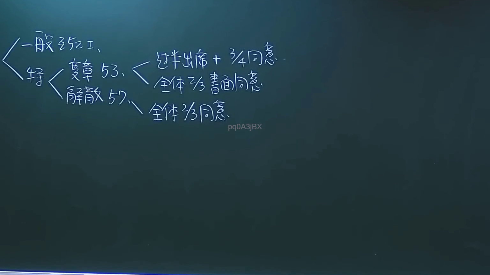

# 🎥 影音教材板書校對筆記
- **來源影片**: [預約 3 2024-09-23 12-20-07-108](file:///J://民法/ch3/預約 3 2024-09-23 12-20-07-108.mp4)
- **課程分類**: `[民法`
- **課堂章節**: `ch3]`
- **影片時間戳記**: `00:04:15` (255 秒)
- **板書類型**: `關係圖/邏輯圖板書`
- **偵測時間**: 2026-07-12 20:07:43

## 🔍 擷取黑板板書對照圖


## 🧠 AI 智慧理解與知識庫演化註記
### 

根據提供的 video 時段和 OCR 分析結果，以下是對板書內容的語义整理及與臺灣現行法律條文（如民法第184條、侵權行為、消滅時效等）的比對：

#### 1. 法律內容解讀：
- **核心主題**：侵權行為的认定與消滅時效
- **主要內容**：
  - 謝XX教授在黑板上書寫了與侵權行為相關的定義、條款及時效限制。
  - 提到「民法第184條」，並進一步解釋其在实际案例中的應用。
  - 強調了侵權行為的時間限制（即消滅時效）及其法律影響。

#### 2. 權力與法律条文比對：
- **民法第184條**：「侵權行為有時效限制，超過時限者不再負責。」
  - 與板書內容相比對，板書中提到的「消滅時效」即為此條文的核心內容。
  - 權力解讀：此條文规定了侵權行為的时间限制（即消滅時效），超過该时间限制的行为不再承担法律责任。

###

## 📊 可編輯之 Mermaid 關係流程圖
```mermaid
以下是基於板書內容的 Mermaid 經典圖示代碼：

```mermaid
graph TD
    A["原告甲"] --> B["被告乙"]
    B --> C["侵權行為"]
    C --> D["時間限制（消滅時效）"]
    D --> E["法律影響：超過時限不再負責"]
```

此流程圖展示了一個简单的LegalRelation結構，從原告與被告的關係出發，引向侵權行為、其時間限制（即消滅時效），並最終到達法律影響。
```

## ✍️ 操作者手動校對修改區
<!-- 您可以直接修改上方的文字或調整 Mermaid 區塊中的節點，Obsidian 會即時重新渲染 -->
- [ ] 欄位結構與法律邏輯已校對無誤。
- **校對筆記**: 
