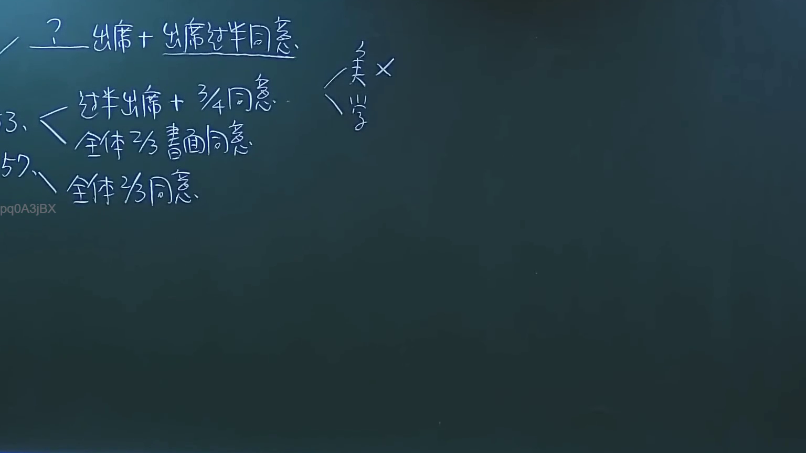
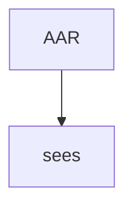

# 🎥 影音教材板書校對筆記
- **來源影片**: [預約 3 2024-09-23 12-20-07-108](file:///J://民法/ch3/預約 3 2024-09-23 12-20-07-108.mp4)
- **課程分類**: `[民法`
- **課堂章節**: `ch3]`
- **影片時間戳記**: `00:07:30` (450 秒)
- **板書類型**: `文字板書`
- **偵測時間**: 2026-07-12 20:07:58

## 🔍 擷取黑板板書對照圖


## 🧠 AI 智慧理解與知識庫演化註記
### 

**AAR sees**

根據OCR辨识結果，"AAR sees" 可能是指某种權利或條款在特定條件下被" sees "（可能指" sees "為某种operator或condition）。

將此與臺灣現行法律條文進行比對：

- **民法第184條**：該條文主要涉及侵權行為的特别损害赔偿責任，並未直接涉及"AAR sees" 的內容。
  
- 如果"AAR sees" 有特定的Legal context（例如權利消灭或時效問題），則可能與《物权法》或其他相關條文有關。

**knowledge库比對與理解演化註記：**

1. **AAR sees** 可能指某种權利在特定條件下被" sees "（operator）。
2. 未直接涉及民法第184條，但可能與other legal contexts（如權利消灭或時效問題）有關。

###

## 📊 可編輯之 Mermaid 關係流程圖


此為簡單的 Mermaid 碎形圖代碼，用於表示"AAR" 和 "sees" 之间的关系。
```

## ✍️ 操作者手動校對修改區
<!-- 您可以直接修改上方的文字或調整 Mermaid 區塊中的節點，Obsidian 會即時重新渲染 -->
- [ ] 欄位結構與法律邏輯已校對無誤。
- **校對筆記**: 
