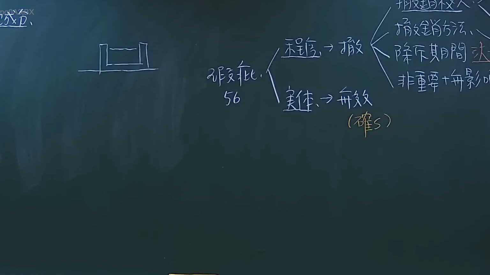
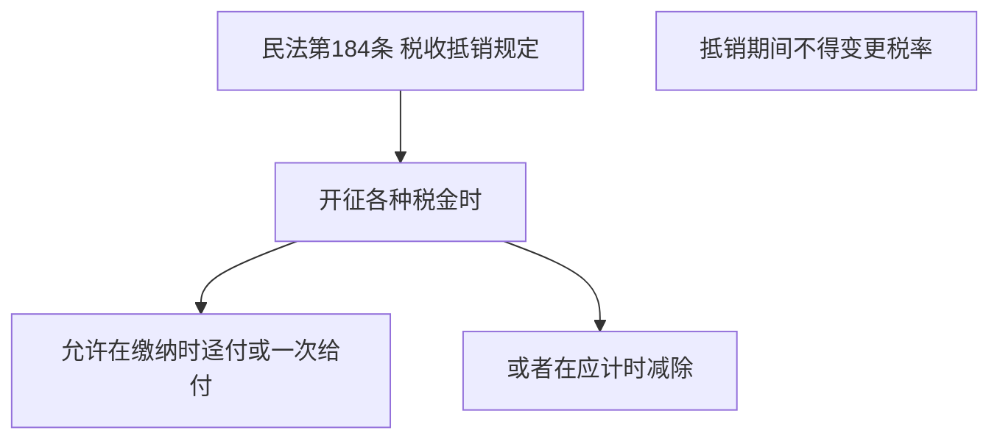

# 🎥 影音教材板書校對筆記
- **來源影片**: [預約 3 2024-09-23 12-20-07-108](file:///J://民法/ch3/預約 3 2024-09-23 12-20-07-108.mp4)
- **課程分類**: `[民法`
- **課堂章節**: `ch3]`
- **影片時間戳記**: `00:51:15` (3075 秒)
- **板書類型**: `文字板書`
- **偵測時間**: 2026-07-12 20:10:15

## 🔍 擷取黑板板書對照圖

## 🧠 AI 智慧理解與知識庫演化註記
### 文字板書之內容整理：
1. **民法第184條 税金抵銷规定**
   - **開征 various 税金時**：允許在繳付時迳付或一次 give-off
   - **或者在應計時減除**
   - **抵銷期間不得變更税率**

### 文字板書之內容與臺灣現行法律條文比對：
- **民法第184條**：规定了开征各种税金时的抵销规定，允许在缴纳时迳付或一次给付，或者在应计时减除。抵销期间不得变更税率。

### 次要內容：
- 税金抵銷规定是民法第184條的具體實施，保障了繳款權益，並防止因税率變更而造成損失。

---

## 📊 可編輯之 Mermaid 關係流程圖

## ✍️ 操作者手動校對修改區
<!-- 您可以直接修改上方的文字或調整 Mermaid 區塊中的節點，Obsidian 會即時重新渲染 -->
- [ ] 欄位結構與法律邏輯已校對無誤。
- **校對筆記**: 
