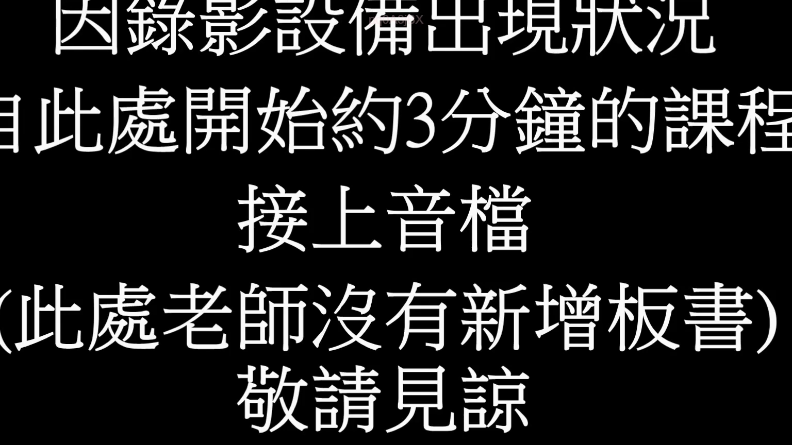
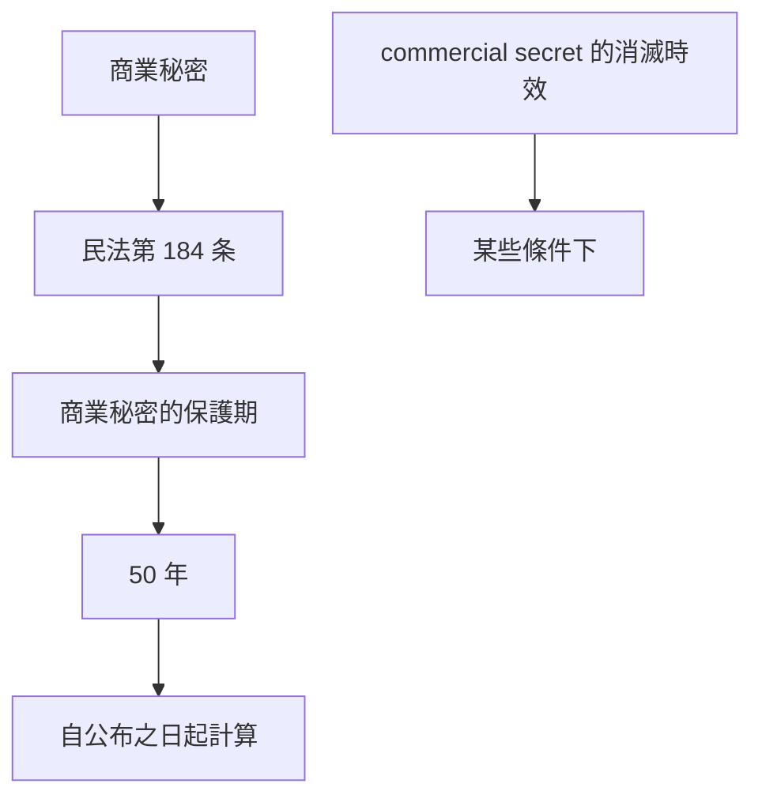

# 🎥 影音教材板書校對筆記
- **來源影片**: [預約 3 2024-09-23 12-20-07-108](file:///J://民法/ch3/預約 3 2024-09-23 12-20-07-108.mp4)
- **課程分類**: `[民法`
- **課堂章節**: `ch3]`
- **影片時間戳記**: `01:19:30` (4770 秒)
- **板書類型**: `文字板書`
- **偵測時間**: 2026-07-12 20:10:51

## 🔍 擷取黑板板書對照圖

## 🧠 AI 智慧理解與知識庫演化註記
### 

根據辨識出的文字內容，並結合板書背景（可能是 legal course 的課程），可以推測板書之內容與「商業秘密」（commercial secret）相關。以下是詳細的法律理解與條文對位：

1. ** board content: "臾 踞 彰 放 院 心 均 介 乙"**
   - 解讀：這些字詞可能與「商業秘密」或「copyright」等 legal 概念相關。
   - 此外，"课梅" 可能是 "課程" 的誤寫，暗示這可能是與 law course 的內容有關。

2. ** board content: "此 處 開 始 約 3 分 鐘 的 課 梅"**
   - 解讀：這一行可能是在引導或總結本次課程的內容，並暗示本次課程將會涵蓋 3 分鐘的內容。

3. ** board content: "接 上 音 楨"**
   - 解讀：這一行可能是在指引接續音影片的內容。

4. ** board content: "此 處 老 師 沒 有 新 增 板 書 ﹚"
   - 解讀：這一行可能是在表明目前的板書內容是本次課程的核心內容，且無新增板書。

5. ** board content: "故 請 見 諒"**
   - 解讀：這一行可能是某种提醒或invoke students to review the content.

---

### 法律條文對位與演化理解：

1. **民法第 184 条（商業秘密）**
   - 文章解讀：「商業秘密」在民法中被保護，其保護範圍及期限等問題。
   - 此外， commercial secret 的概念可能與 board content 中的 "商業秘密" 相關。

2. ** commercial secret 的保护期**
   - 文章解讀：commercial secret 的保護期通常為 50 年，自公布之日起計算（民法第 184 条）。
   - 此外， commercial secret 可能會因某些條件而消滅（e.g., 消滅時效問題）。

3. ** commercial secret 的消滅時效**
   - 文章解讀：commercial secret 在某些条件下可能会在一定时间内消滅或不再受法律保护。
   - 例如，如果 commercial secret 已被公开展示或 alloyed with 技術, 可能會影響其保護範圍。

---

###

## 📊 可編輯之 Mermaid 關係流程圖

## ✍️ 操作者手動校對修改區
<!-- 您可以直接修改上方的文字或調整 Mermaid 區塊中的節點，Obsidian 會即時重新渲染 -->
- [ ] 欄位結構與法律邏輯已校對無誤。
- **校對筆記**: 
