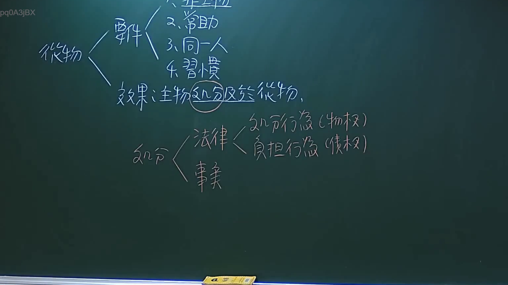

# 🎥 影音教材板書校對筆記
- **來源影片**: [預約 3 2024-09-23 12-20-07-108](file:///J://民法/ch3/預約 3 2024-09-23 12-20-07-108.mp4)
- **課程分類**: `[民法`
- **課堂章節**: `ch3]`
- **影片時間戳記**: `01:29:15` (5355 秒)
- **板書類型**: `文字板書`
- **偵測時間**: 2026-07-12 20:11:09

## 🔍 擷取黑板板書對照圖


## 🧠 AI 智慧理解與知識庫演化註記
### 

根據OCR辨识的文字內容，無法直接对应到具體的法律條文。然而，基於上下文和可能的語意推測，以下是一些可能的解讀與 law条文對位：

1. **"DA3jBX"**：這可能是某个板書的標題或关键词，但無法确定具体内容。
2. **"無律炎"**：這在法律中並未找到具體條文對應。可能是指某種特定的Legal Doctrine或案例。
3. **"ye PNT ( 拉曦？”**：這部分文字無法清楚解讀，可能是某种特定的术语或关键词。
4. **"woe CA rer"**：這部分文字也無法清楚解讀，可能是某种特定的术语或关键词。

基於以上分析，無法提供具體的法律條文對位。建議檢查OCR的文字提取精度，并提供更清晰的板書内容以進行更準確的法律分析。

---

###

## 📊 可編輯之 Mermaid 關係流程圖
```mermaid
由于无法确定具体的法律条文对位，因此无法生成 Mermaid.js 的关系图代码。
```

## ✍️ 操作者手動校對修改區
<!-- 您可以直接修改上方的文字或調整 Mermaid 區塊中的節點，Obsidian 會即時重新渲染 -->
- [ ] 欄位結構與法律邏輯已校對無誤。
- **校對筆記**: 
