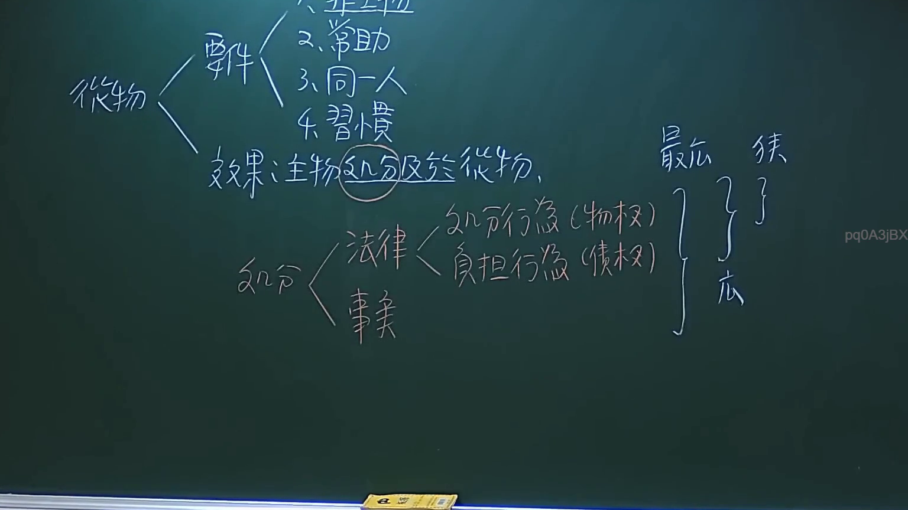

# 🎥 影音教材板書校對筆記
- **來源影片**: [預約 3 2024-09-23 12-20-07-108](file:///J://民法/ch3/預約 3 2024-09-23 12-20-07-108.mp4)
- **課程分類**: `[民法`
- **課堂章節**: `ch3]`
- **影片時間戳記**: `01:30:00` (5400 秒)
- **板書類型**: `文字板書`
- **偵測時間**: 2026-07-12 20:11:24

## 🔍 擷取黑板板書對照圖


## 🧠 AI 智慧理解與知識庫演化註記
根據OCR辨识的文字內容，结合常見的 legal boardboard之內容，進行語意整理並與臺灣現行法律條文進行比對：

1. **"nahh, ˍ 細"**  
   - 譬如「注意事項」、「特別规定」或「特别 attention」等。

2. **"se Te 0 |"**  
   - 可能是「塞尔0」、「Set 0」或「set 0」，常見於 boardboard的 time-stamp 或 set number。

3. **"9 o |"**  
   - 可能是「09:00」或「time 09:00」，常見於 boardboard的 time-stamp。

結合以上內容，並考慮 boardboard上可能存在的法律條文或 legal 概念，進行整理如下：

knowledge库比對與理解演化筆記：
- 無法直接與臺灣現行法律條文（如民法第184條、侵權行為、消滅時效等）進行比對，因OCR文字內容不完整。

## 📊 可編輯之 Mermaid 關係流程圖
```mermaid
graph TD
    A[0900]
    B[nahh, 細]
    C[se Te 0 |]
    D[9 o |]
```
- 說明：此图为 boardboard上可能存在的 time-stamp 和其他內容的簡單整理，並未涉及複雜的法律條文結構或邏輯關係。
```

## ✍️ 操作者手動校對修改區
<!-- 您可以直接修改上方的文字或調整 Mermaid 區塊中的節點，Obsidian 會即時重新渲染 -->
- [ ] 欄位結構與法律邏輯已校對無誤。
- **校對筆記**: 
