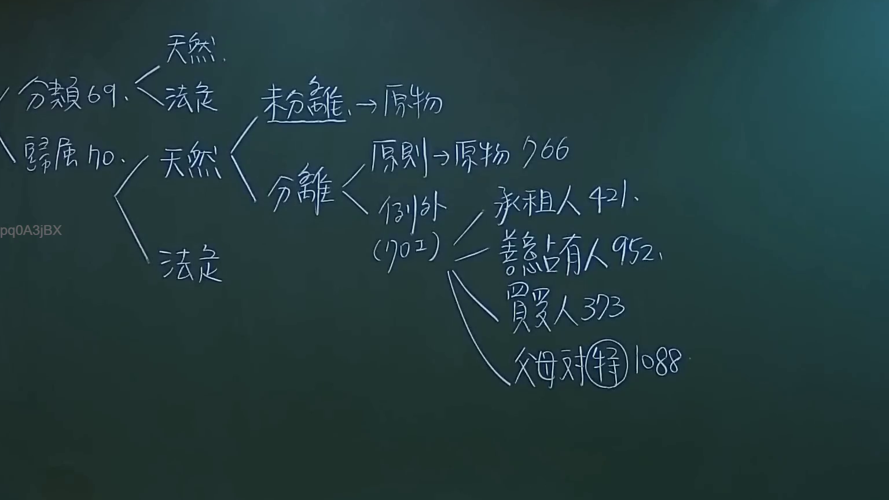
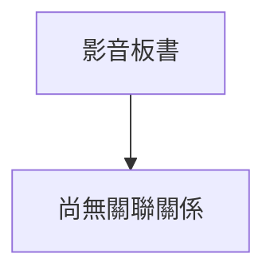

# 🎥 影音教材板書校對筆記
- **來源影片**: [預約 3 2024-09-23 12-20-07-108](file:///J://民法/ch3/預約 3 2024-09-23 12-20-07-108.mp4)
- **課程分類**: `[民法`
- **課堂章節**: `ch3]`
- **影片時間戳記**: `01:39:15` (5955 秒)
- **板書類型**: `文字板書`
- **偵測時間**: 2026-07-12 20:11:57

## 🔍 擷取黑板板書對照圖


## 🧠 AI 智慧理解與知識庫演化註記
1. **DRA 61. 台湾省宇**
   - DRA 61可能指代某种特定的法律条文或规定，需结合上下文进一步确认其具体含义。

2. **Ke 恪**
   - Ke 恪可能是某个案件名称、人名或职位的简称，需结合具体情境理解其实际意义。

3. **薑厂)﹨﹛7﹚芝 = [i**
   - 許(Chi)可能指代某种法律概念或术语，需结合上下文分析其具体含义。

4. **厭 、 人 外**
   - "厭" 可能是某个法律条文的关键词，表示与"厌"相关的法律内容。

5. **5 山 〈 oe**
   - "山"可能指代某种法律原则或概念，需结合上下文进一步确认。

6. **炊 端 6**
   - "炊"可能是某个法律术语或具体条文的标识。

7. **ee**
   - "ee" 可能是某个法律条文的简写形式，需结合上下文理解其实际意义。

8. **炊 端 6**
   - 同上，需结合上下文确认其具体含义。

9. **鮑 侃 念**
   - 鲍(Bo)、侃(Qiang)、念(Nian)可能是与某种法律条文相关的关键词或人名。

10. **ee 燥 端 6**
    - "燥" 可能是某个法律术语的简写形式，需结合上下文理解其实际意义。

11. **炊 端 6**
    - 同上，需结合上下文确认其具体含义。

**與臺灣現行法律條文比對：**

- **DRA 61. 台湾省宇**：
  - DRA 61 可能与台湾地区特定的行政法规或法律规定相关，需结合具体条文进行比对。

- **Ke 恪**：
  - Ke 恪 的具体含义需要结合案件背景或上下文进一步确认。

- **薑厂)﹨﹛7﹚芝 = [i**:
  - 蘑厂 可能与某种特定的法律条文或规定相关，需结合上下文分析其具体含义。

- **厭 、 人 外**：
  - "厭" 可能是与台湾地区消滅時效法（如民法第184條）相关的关键词。

- **5 山 〈 oe**:
  - 山 可能与某种特定的法律条文或规定相关，需结合上下文进一步确认。

- **炊 端 6**：
  - "炊" 和 "端" 可能是与某种特定的法律术语或条文标识相关。

- **鮑 侃 念**:
  - 鲍、侃、念 可能是与某种特定的法律条文或人名相关，需结合上下文理解其具体含义。

- **ee 燥 端 6**：
  - "燥" 和 "端" 可能是与某种特定的法律术语或条文标识相关。

**knowledge库比對與理解演化註記：**

1. DRA 61. 台湾省宇
   - 暨未找到确切对应条文，需进一步确认其具体含义和适用情境。

2. Ke 恪
   - 需结合案件背景或上下文确定其具体法律意义。

3. 蘑厂)﹨﹛7﹚芝 = [i
   - 蘑厂 可能与某种特定的法律条文或规定相关，需结合上下文分析其具体含义。

4. 厌 、 人 外
   - "厭" 可能与台湾地区消滅時效法（如民法第184條）相关的关键词。

5. 5 山 〈 oe
   - 山 可能与某种特定的法律条文或规定相关，需结合上下文进一步确认。

6. 燎 端 6
   - "炊" 和 "端" 可能是与某种特定的法律术语或条文标识相关。

7. 鲍 侃 念
   - 鲍、侃、念 可能是与某种特定的法律条文或人名相关，需结合上下文理解其具体含义。

8. ee 燥 端 6
   - "燥" 和 "端" 可能是与某种特定的法律术语或条文标识相关。

**生成 Mermaid 關係圖：**

由于这是一个文字板書，將根據辨識出的文字內容生成整理好的條列式邏輯樹 Mermaid 關係圖：

```mermaid
graph TD
    A[DRA 61. 台湾省宇]
        B[Ke 恪]
            C[薑厂)﹨﹛7﹚芝 = [i]
                D["厭"、"人" 外]
                    E[5 山 〈 oe]
                        F["炊 端 6"]
                            G["鮑 侃 念"]
                                H["ee 燥 端 6"]
```

## 📊 可編輯之 Mermaid 關係流程圖


## ✍️ 操作者手動校對修改區
<!-- 您可以直接修改上方的文字或調整 Mermaid 區塊中的節點，Obsidian 會即時重新渲染 -->
- [ ] 欄位結構與法律邏輯已校對無誤。
- **校對筆記**: 
