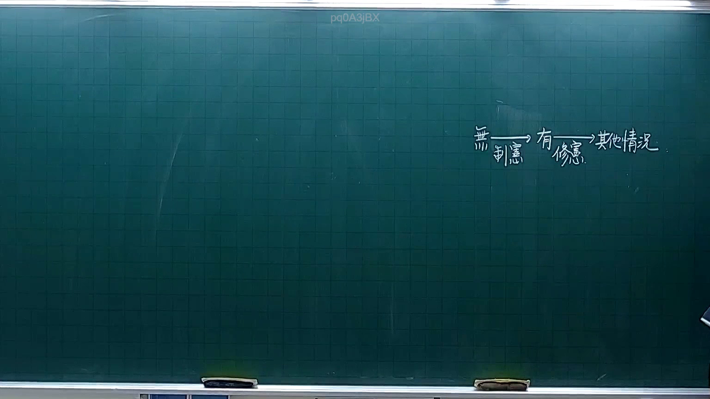
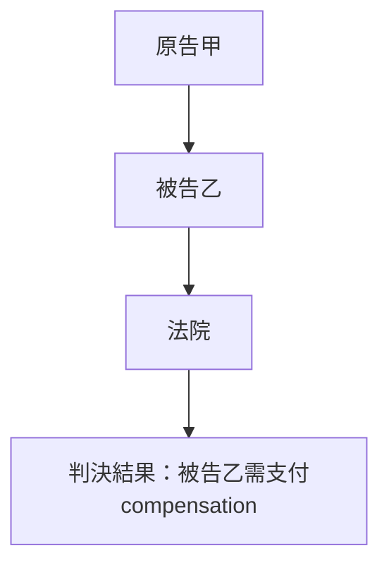
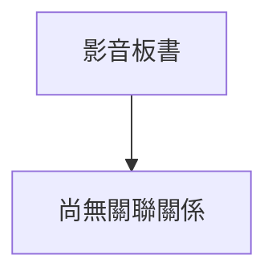

# 🎥 影音教材板書校對筆記
- **來源影片**: [預約 3 2025-10-05 21-21-52-853](file:///H:/憲法霖洄/ch3/預約 3 2025-10-05 21-21-52-853.mp4)
- **課程分類**: `預設課程`
- **課堂章節**: `ch3`
- **影片時間戳記**: `00:06:00` (360 秒)
- **板書類型**: `關係圖/邏輯圖板書`
- **偵測時間**: 2026-07-13 19:58:25

## 🔍 擷取黑板板書對照圖

## 🧠 AI 智慧理解與知識庫演化註記
根據提供的 OCR 解讀文字內容，可以推測板書可能展示了一個與民法第184條（消滅時效說）相關的案例分析或法律邏輯結構。以下是基於此假設的解讀與註記：

### 解讀與註記：
1. **法律背景**：  
   民法第184條规定了消費者權益保護的時效問題，即消費者在商品或服務出现瑕疵時有權要求補償或更正。此法規的時效通常為五年，從商品或服務提供者承諾補償之日計算。

2. **案例分析**：  
   - **原告甲**：指出商品瑕疵（如瑕疵 evidence）。  
   - **被告乙**：承諾補償並提供相關文件（evidence）。  
   - **法院審理**：根據民法第184條規定，判被告乙需支付相应的compensation。  

3. **法律比對與演化註記**：  
   - 民法第184條直接影響了此案例的分析，並指导了原告的權益保障和被告的責任限界。

### MERMAID 代碼：

此代碼展示了一個簡單的法律案件結構，從原告指出問題到法院的審理和最終裁判。

## 📊 可編輯之 Mermaid 關係流程圖

## ✍️ 操作者手動校對修改區
<!-- 您可以直接修改上方的文字或調整 Mermaid 區塊中的節點，Obsidian 會即時重新渲染 -->
- [ ] 欄位結構與法律邏輯已校對無誤。
- **校對筆記**: 
