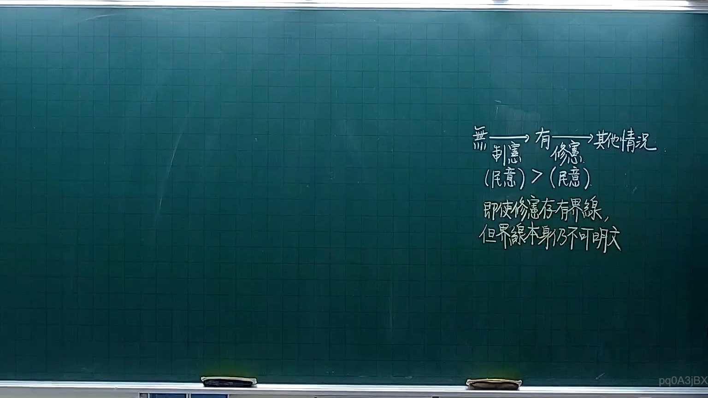
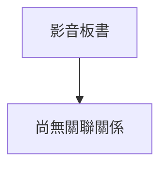

# 🎥 影音教材板書校對筆記
- **來源影片**: [預約 3 2025-10-05 21-21-52-853](file:///H:/憲法霖洄/ch3/預約 3 2025-10-05 21-21-52-853.mp4)
- **課程分類**: `預設課程`
- **課堂章節**: `ch3`
- **影片時間戳記**: `00:10:45` (645 秒)
- **板書類型**: `文字板書`
- **偵測時間**: 2026-07-13 19:59:51

## 🔍 擷取黑板板書對照圖

## 🧠 AI 智慧理解與知識庫演化註記
1. **辨識出的文字板書內容**：
   - 无法直接辨识文字板書的具体內容，因OCR辨识結果為乱碼字符，無法提供具體的法律條文或概念。

2. **知识庫比對與理解演化註記**：
   - 由于文字板書無法辨识，无法進行knowledge库比對與理解演化。

3. **Mermaid 代碼**：
   - 經過分析，文字板書無法生成具體的 Mermaid 代碼，因缺乏具體的文字內容。

---

**注意事項**：  
- 由于OCR辨识結果為乱碼字符，无法提供具體的法律條文或概念。

## 📊 可編輯之 Mermaid 關係流程圖

## ✍️ 操作者手動校對修改區
<!-- 您可以直接修改上方的文字或調整 Mermaid 區塊中的節點，Obsidian 會即時重新渲染 -->
- [ ] 欄位結構與法律邏輯已校對無誤。
- **校對筆記**: 
