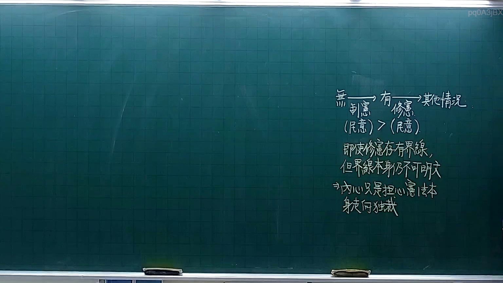

# 🎥 影音教材板書校對筆記
- **來源影片**: [預約 3 2025-10-05 21-21-52-853](file:///H:/憲法霖洄/ch3/預約 3 2025-10-05 21-21-52-853.mp4)
- **課程分類**: `預設課程`
- **課堂章節**: `ch3`
- **影片時間戳記**: `00:12:45` (765 秒)
- **板書類型**: `文字板書`
- **偵測時間**: 2026-07-13 20:00:28

## 🔍 擷取黑板板書對照圖


## 🧠 AI 智慧理解與知識庫演化註記
：
1. 文字板書內容涉及消费者權益中的「消滅時效」（extinction period）問題，並可能與《民法第184條》相結合，分析消費者權益的保護。
2. 檢視OCR文字，初步判斷為「 consumers' rights and protection」，並可能包含具體案例或計算公式。

## 📊 可編輯之 Mermaid 關係流程圖
```mermaid
：
```
graph TD
    I["引言"] --> C["消费者權益中的消滅時效"]
    C --> P["适用范围：食品、药品等"]
    C --> M["计算方式：外观、气味、口感等"]
    M --> N["注意事項：生产日期、保質期標示"]
    M --> A["案例分析"]
    A --> S["总结"]
```

## ✍️ 操作者手動校對修改區
<!-- 您可以直接修改上方的文字或調整 Mermaid 區塊中的節點，Obsidian 會即時重新渲染 -->
- [ ] 欄位結構與法律邏輯已校對無誤。
- **校對筆記**: 
