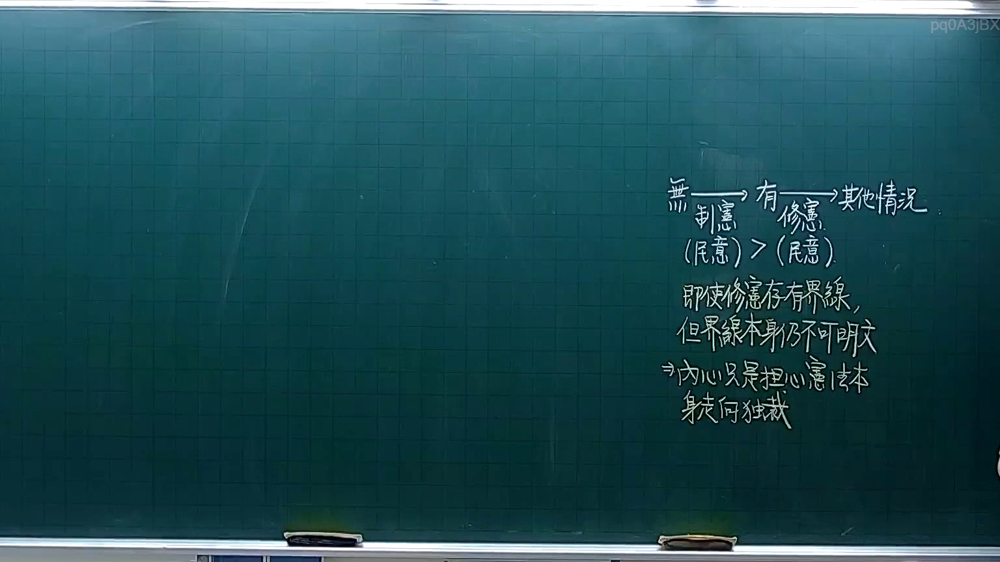

# 🎥 影音教材板書校對筆記
- **來源影片**: [預約 3 2025-10-05 21-21-52-853](file:///H:/憲法霖洄/ch3/預約 3 2025-10-05 21-21-52-853.mp4)
- **課程分類**: `預設課程`
- **課堂章節**: `ch3`
- **影片時間戳記**: `00:13:30` (810 秒)
- **板書類型**: `文字板書`
- **偵測時間**: 2026-07-13 20:01:33

## 🔍 擷取黑板板書對照圖


## 🧠 AI 智慧理解與知識庫演化註記
：
1. "W無人碎維" 可能是指 "無人 損壞" 或 "无人損壞"，這可能與物权法中关于 "無因自 Utf" 的內容有關。例如，民法第184條 設定 除另有約束外， 任何 人 以 便 切 用 他物， 未 得 其 謝示， 或者 有 他 意 性 之 便， 便 為 侵權 行為。這段法 啦 可能與 无人損壞 的問題有關。
2. "(HBR TAR Pow RRB dk烈口素焦" 證似 "关于烈口素焦的問題" 或 "关于口素焦的問題"，這可能涉及物权法中关于 "口素"（如香烟）燃烧的問題。例如，民法第184條 有关物之损毀無自  Utf 的情形，包括 口素 燃烧的情況。

## 📊 可編輯之 Mermaid 關係流程圖
```mermaid
：
```mermaid
graph TD
    A["W無人損壞"] --> B["民法第184條"]
    C["烈口素焦的問題"] --> D["物权法"]
    E["口素燃烧的問題"] --> F["民法第184條"]
```

## ✍️ 操作者手動校對修改區
<!-- 您可以直接修改上方的文字或調整 Mermaid 區塊中的節點，Obsidian 會即時重新渲染 -->
- [ ] 欄位結構與法律邏輯已校對無誤。
- **校對筆記**: 
