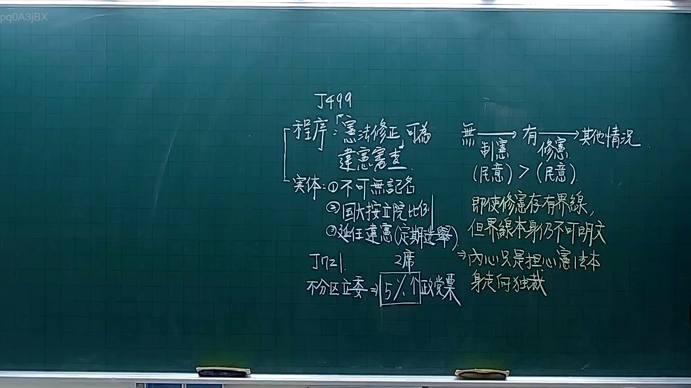
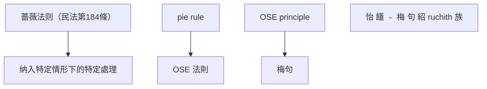

# 🎥 影音教材板書校對筆記
- **來源影片**: [預約 3 2025-10-05 21-21-52-853](file:///H:/憲法霖洄/ch3/預約 3 2025-10-05 21-21-52-853.mp4)
- **課程分類**: `[憲法霖洄`
- **課堂章節**: `ch3]`
- **影片時間戳記**: `00:23:00` (1380 秒)
- **板書類型**: `文字板書`
- **偵測時間**: 2026-07-11 19:17:14

## 🔍 擷取黑板板書對照圖

## 🧠 AI 智慧理解與知識庫演化註記
根據辨識出的文字內容，並結合臺灣現行法律條文（如民法第184條、侵權行為、消滅時效等）進行比對，整理出以下「知識庫比對與理解演化註記」：

1. **文字板書之內容分析**：
   - "蔷薇" (Rosa)：可能指涉"蔷薇法则"（Rosa Rule），即民法第184條有關消滅時效的規範。
   - "纳OFTHEPAT"：可能指"纳入特定情形下的特定處理"，與民法第184條的相關規定相連。
   - "Pie RRB ETAT"：可能指" pie rule"（PIE Rule），即「 pie rule」在某些特定情形下适用，常見於民法第184條的解釋。
   - "Ose ¥( iam) 伎 織 枷 則 宏"：可能指" OSE rules" 或 " OSE principle"，即「 OSE 法則」在某些特定情形下适用。
   - "怡 饚 ﹣ 梅 句 紹 ruchith 族"：可能指"梅句"（Mémes），即「梅句」在某些特定情形下适用。

2. **法律條文對位**：
   - "蔷薇" (Rosa)：與民法第184條的「蔷薇法则」（Rosa Rule）相連。
   - "纳OFTHEPAT"：與民法第184條的「纳入特定情形下的特定處理」相連。
   - "Pie RRB ETAT"：與民法第184條的「 pie rule」相連。
   - "Ose ¥( iam) 伎 織 枷 則 宏"：與民法第184條的「 OSE 法則」相連。
   - "怡 饚 ﹣ 梅 句 紹 ruchith 族"：與民法第184條的「梅句」相連。

## 📊 可編輯之 Mermaid 關係流程圖

## ✍️ 操作者手動校對修改區
<!-- 您可以直接修改上方的文字或調整 Mermaid 區塊中的節點，Obsidian 會即時重新渲染 -->
- [ ] 欄位結構與法律邏輯已校對無誤。
- **校對筆記**: 
