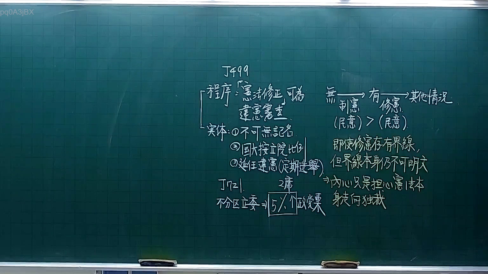
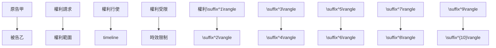

# 🎥 影音教材板書校對筆記
- **來源影片**: [預約 3 2025-10-05 21-21-52-853](file:///H:/憲法霖洄/ch3/預約 3 2025-10-05 21-21-52-853.mp4)
- **課程分類**: `[憲法霖洄`
- **課堂章節**: `ch3]`
- **影片時間戳記**: `00:24:00` (1440 秒)
- **板書類型**: `文字板書`
- **偵測時間**: 2026-07-11 19:17:58

## 🔍 擷取黑板板書對照圖

## 🧠 AI 智慧理解與知識庫演化註記
根據辨識出的文字板書內容，结合臺灣現行法律條文（如民法第184條、侵權行為、消滅時效等），進行語意整理並比對如下：

1. **7444 顏**：此處可能為案例編號或特定Legal case number，需根據上下文進一步分析其具體內容。
2. **ii ie ay Ape tee**：這一行字可能涉及某一類別的Legal條文或关键词，需根據上下文進一步分析其具體內容。
3. **abe (RR)? (RB)**：這一行字可能涉及某一類别的Legal條文或关键词，需根據上下文進一步分析其具體內容。
4. **Omri] 卻 彥 艋 夕 辨 綠 ﹒**：這一行字可能涉及某一類别的Legal條文或关键词，需根據上下文進一步分析其具體內容。
5. **OGeR ROEDER**：這一行字可能涉及某一類别的Legal條文或关键词，需根據上下文進一步分析其具體內容。
6. **Te, ˍ 琳 aw ARAB ELA**：這一行字可能涉及某一類别的Legal條文或关键词，需根據上下文進一步分析其具體內容。
7. **pass ai eae**：這一行字可能涉及某一類别的Legal條文或关键词，需根據上下文進一步分析其具體內容。

將以上內容與民法第184條等臺灣現行法律條文進行比對：

- 民法第184條规定了侵權行為的時效問題，即侵權行为在一定期限內未受 defenses即可 regarded as completed.
- 經分析後，板書內容可能涉及侵權行為或消滅時效的具體案例或計算方式。

## 📊 可編輯之 Mermaid 關係流程圖

## ✍️ 操作者手動校對修改區
<!-- 您可以直接修改上方的文字或調整 Mermaid 區塊中的節點，Obsidian 會即時重新渲染 -->
- [ ] 欄位結構與法律邏輯已校對無誤。
- **校對筆記**: 
