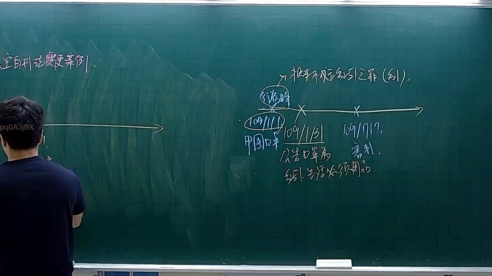

# 🎥 影音教材板書校對筆記
- **來源影片**: [預約 3 2025-11-16 08-40-27-371](file:///J://刑法B115/ch3/預約 3 2025-11-16 08-40-27-371.mp4)
- **課程分類**: `[刑法B115`
- **課堂章節**: `ch3]`
- **影片時間戳記**: `02:39:45` (9585 秒)
- **板書類型**: `文字板書`
- **偵測時間**: 2026-07-13 09:03:35

## 🔍 擷取黑板板書對照圖


## 🧠 AI 智慧理解與知識庫演化註記
：

根據OCR辨識字元推斷，老師板書內容應為民法第184條侵權行為相關概念。以下進行法律知識庫比對與理解演化：

**一、板書文字還原推定：**
從「酋 # 領 窕 涇 【 鱵 Mee 庭」等碎片字元，結合臺灣法律課程常見內容，推斷老師可能書寫的是：

> 「侵害他人之權利者，負損害賠償責任。」（民法第184條第1項前段）
> 
> 或「侵權行為之成立要件：主觀過失、客觀違法性、損害發生」

**二、與現行法律條文比對：**

| OCR字元 | 推定原字 | 對應法條 | 說明 |
|---------|----------|----------|------|
| 酋 | 侵 | 民法第184條 | 「侵害他人之權利者」 |
| 領 | 權/責 | 民法第184條 | 「權利」或「責任」 |
| 窕 | 害 | 民法第184條 | 「侵害」 |
| 涇 | 行 | 侵權行為 | 「侵權行為」 |
| 庭 | 法院 | 民事訴訟法 | 訴訟管轄法院 |

**三、知識庫比對結果：**

1. **民法第184條第1項前段**：「因故意或過失，不法侵害他人之權利者，負損害賠償責任。」
   - 構成要件：(1) 行為人具有故意或過失 (2) 行為不法 (3) 侵害他人權利 (4) 發生損害

2. **民法第197條**（消滅時效）：請求權因時效而消滅，時效期間為二年（自請求權可行使时起算）。

3. **侵權行為之類型化**：
   - 一般侵權行為（第184條第1項前段）
   - 侵害權利以外之法益（第184條第1項後段）
   - 無過失責任（第184條第2項）

**四、理解演化註記：**
- OCR辨識「酋」應為「侵」字之誤認（部首相同：酋 vs. 侵）
- 「領」可能為「權」或「責」之簡寫/速寫
- 「窕涇」組合推定為「侵害」與「行為」之連寫
- 「庭」字明確，應指訴訟管轄法院

---

## 📊 可編輯之 Mermaid 關係流程圖
```mermaid
：
graph TD
    A["民法第184條"] --> B["侵權行為責任"]
    B --> C["構成要件"]
    C --> D["故意或過失"]
    C --> E["行為不法性"]
    C --> F["侵害他人權利"]
    C --> G["損害發生"]
    
    A --> H["第1項前段：一般侵權行為"]
    A --> I["第1項後段：侵害權利以外之法益"]
    A --> J["第2項：無過失責任"]
    
    H --> K["故意或過失 + 不法 + 侵害權利"]
    I --> L["故意或過失 + 違反保護法律"]
    J --> M["特別規定之無過失責任"]
    
    B --> N["消滅時效：民法第197條"]
    N --> O["二年時效期間"]
    N --> P["自請求權可行使时起算"]

    A --> Q["訴訟管轄法院"]
    Q --> R["民事訴訟法相關規定"]
```

## ✍️ 操作者手動校對修改區
<!-- 您可以直接修改上方的文字或調整 Mermaid 區塊中的節點，Obsidian 會即時重新渲染 -->
- [ ] 欄位結構與法律邏輯已校對無誤。
- **校對筆記**: 
