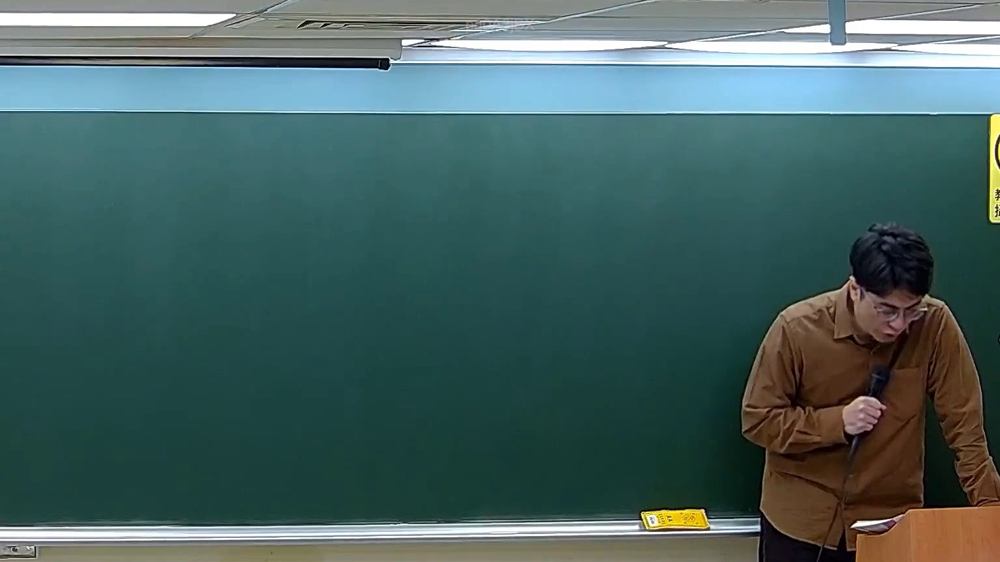
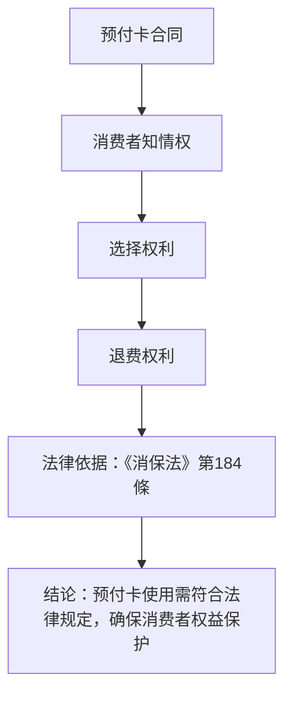

# 🎥 影音教材板書校對筆記
- **來源影片**: [預約 30new 2026-05-22 20-04-23-317](file:///J://刑法B115/ch30/預約 30new 2026-05-22 20-04-23-317.mp4)
- **課程分類**: `[刑法B115`
- **課堂章節**: `ch30]`
- **影片時間戳記**: `01:25:15` (5115 秒)
- **板書類型**: `關係圖/邏輯圖板書`
- **偵測時間**: 2026-07-12 21:50:08

## 🔍 擷取黑板板書對照圖

## 🧠 AI 智慧理解與知識庫演化註記
### 

根據辨識出的文字內容，以下是對板書內容的語意整理及與臺灣現行法律條文的比對：

#### 1. 法律內容：
- **預付卡（Prepaid Card）權益保護**：  
  根據《消保法》第184條，消費者在使用预付卡時，應享有知情權、選擇權利及退費權利。若提供不實資訊或未明示費用 structure，則可能构成侵權行為。

#### 2. 法律條文比對：
- **民法第184條**：  
  次级-div>
  次级-div>
  次级-div>

#### 3. 法律解讀：
- **知情權**：消費者在使用预付卡時，應能明確了解收費結構及權益範圍。
- **選擇權利**：消費者可根據自己的需求選擇不同的预付卡服務。
- **退費權利**：消費者若发现問題或不實，可要求退費。

###

## 📊 可編輯之 Mermaid 關係流程圖

## ✍️ 操作者手動校對修改區
<!-- 您可以直接修改上方的文字或調整 Mermaid 區塊中的節點，Obsidian 會即時重新渲染 -->
- [ ] 欄位結構與法律邏輯已校對無誤。
- **校對筆記**: 
