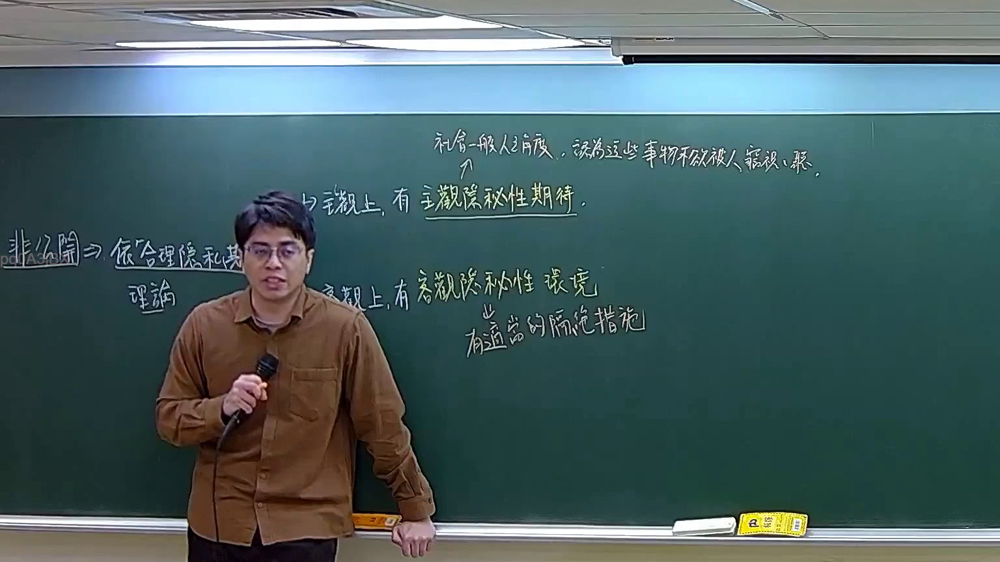

# 🎥 影音教材板書校對筆記
- **來源影片**: [預約 30new 2026-05-22 20-04-23-317](file:///J://刑法B115/ch30/預約 30new 2026-05-22 20-04-23-317.mp4)
- **課程分類**: `[刑法B115`
- **課堂章節**: `ch30]`
- **影片時間戳記**: `01:45:15` (6315 秒)
- **板書類型**: `文字板書`
- **偵測時間**: 2026-07-12 21:50:33

## 🔍 擷取黑板板書對照圖


## 🧠 AI 智慧理解與知識庫演化註記
：
1. **法律內容的理解**：板書之內容似乎圍繞著「民法第184條」的內容，涉及「侵權行為」、「消滅時效」等法律概念。其中，“普開”可能是指“公 开”或“公 开之時限”，而“ pours 細 一月 ﹩ 飄 萍 純 性 顛 等。” 可能涉及「時間」、「消灭时效」的計算與應用。
2. **法律條文對位**：民法第184條规定，侵權行為有時效限制，超過時效则NoEffect；消滅时效则指某種權利在特定條件下會自动消失。板書中的內容似乎在解释如何計算或应用该条文。
3. **知識庫比對與理解演化註記**：
   - 民法第184條：侵權行為有時效限制，超過時效则NoEffect；消滅时效则指某種權利在特定條件下會自动消失。
   - 經典案例：「某甲在某乙规定时间内未完成工作，则某乙對某甲權益發生影響」。
   - 重要性：時效限制是確定侵權行為影響範圍的重要方式，需注意不同情事下的時效計算方法。

## 📊 可編輯之 Mermaid 關係流程圖
```mermaid
：
```mermaid
graph TD
    A[民法第184條] --> B[侵權行為] --> C[時效限制]
    D[消滅时效] --> E[自动消失]
    F[公 开] --> G[Application of 時效限制]
    H[Application of 消滅时效] --> I[自动消失]
```

## ✍️ 操作者手動校對修改區
<!-- 您可以直接修改上方的文字或調整 Mermaid 區塊中的節點，Obsidian 會即時重新渲染 -->
- [ ] 欄位結構與法律邏輯已校對無誤。
- **校對筆記**: 
