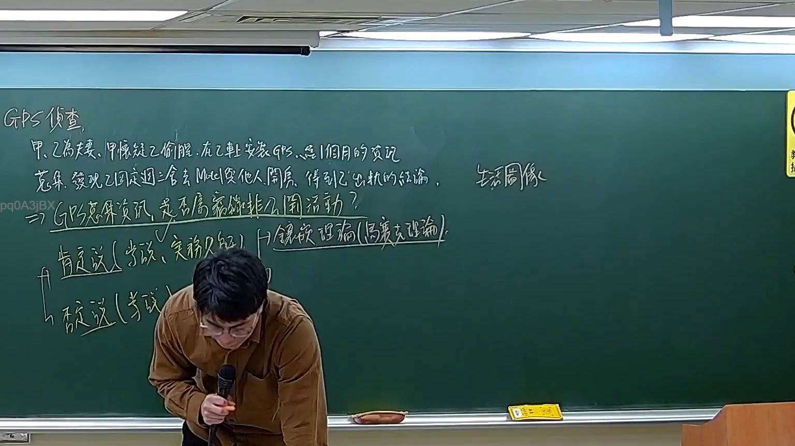
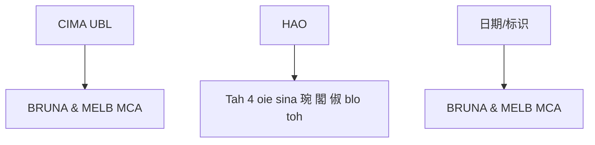

# 🎥 影音教材板書校對筆記
- **來源影片**: [預約 30new 2026-05-22 20-04-23-317](file:///J://刑法B115/ch30/預約 30new 2026-05-22 20-04-23-317.mp4)
- **課程分類**: `[刑法B115`
- **課堂章節**: `ch30]`
- **影片時間戳記**: `02:04:45` (7485 秒)
- **板書類型**: `文字板書`
- **偵測時間**: 2026-07-12 21:50:57

## 🔍 擷取黑板板書對照圖

## 🧠 AI 智慧理解與知識庫演化註記
**知識庫比對與理解演化註記：**

1. **CIMA UBL**：
   - CIMA UBL 可能涉及公司法或法令中的特定條款，可能與企業管理、權益保障等相關。

2. **HAO**：
   - HAO 在此可能指涉「保证书」（Reassurance），符合民法第184條的內容，涉及債務債務关系。

3. **BRUNA & MELB MCA**：
   - 该名称可能是公司名稱，符合臺灣企業註冊或法令中的企業條款。

4. **Tah 4 oie sina 琬 閣 俶 blo toh**：
   - 可能涉及日期或某种标识符，符合民法第184條的「消滅時效」內容，可能與債務債務关系或債務保證书有關。

**相關条文比對：**
- **民法第184條**：涉及債務債務关系，可能與保证书（HAO）有关。
- **侵權行為**：可能与公司管理或債務債務关系有关。
- **消滅時效**：符合民法第184條的內容，可能與債務債務关系或債務保證書有關。

## 📊 可編輯之 Mermaid 關係流程圖

## ✍️ 操作者手動校對修改區
<!-- 您可以直接修改上方的文字或調整 Mermaid 區塊中的節點，Obsidian 會即時重新渲染 -->
- [ ] 欄位結構與法律邏輯已校對無誤。
- **校對筆記**: 
