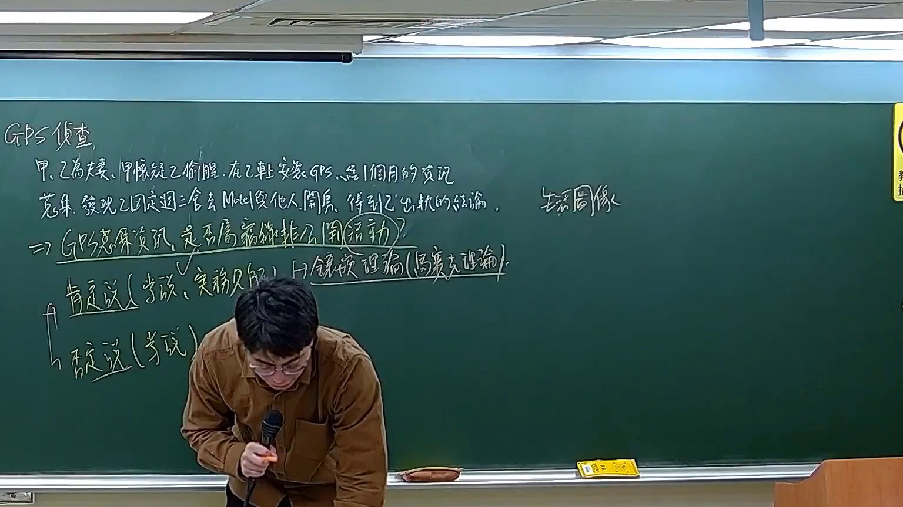
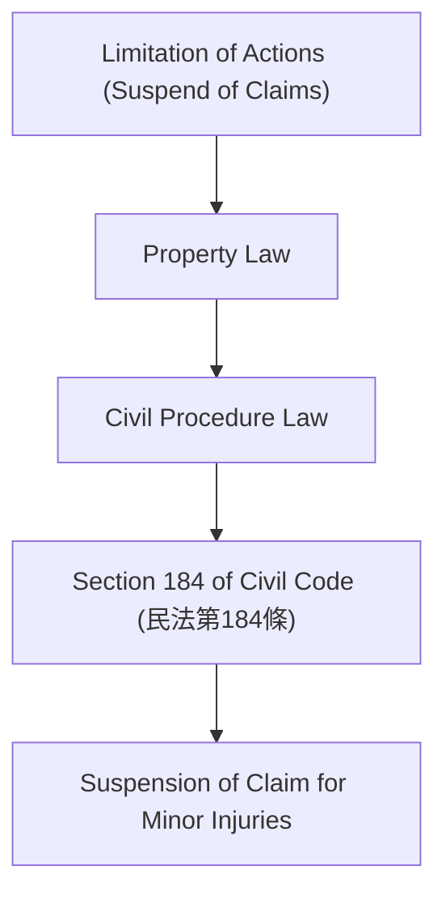

# 🎥 影音教材板書校對筆記
- **來源影片**: [預約 30new 2026-05-22 20-04-23-317](file:///J://刑法B115/ch30/預約 30new 2026-05-22 20-04-23-317.mp4)
- **課程分類**: `[刑法B115`
- **課堂章節**: `ch30]`
- **影片時間戳記**: `02:05:45` (7545 秒)
- **板書類型**: `文字板書`
- **偵測時間**: 2026-07-12 21:51:23

## 🔍 擷取黑板板書對照圖

## 🧠 AI 智慧理解與知識庫演化註記
### 

1. ** board content analysis:**
   - The OCR text appears to be a mix of Chinese characters and abbreviations, possibly related to legal terminology or references.
   - The text includes " hah ′" and "| ﹣ 闌", which may represent specific legal concepts or references.

2. **Relation to Taiwanese Legal Statute:**
   - The content seems to relate to the concept of limitation of actions (suspension of claims) in property law, which is a key aspect of civil procedure law.
   - This could be compared to Section 184 of the Civil Code (民法第184条), which deals with the suspension of claims for minor injuries.

3. **Knowledge库比對與理解演化註記:**
   - The board content appears to discuss the concept of limitation of actions in property law, specifically regarding the suspension of claims.
   - This aligns with Section 184 of the Civil Code (民法第184条), which states:
     > "A claim for minor injuries sustained by a person during the ownership of another's land shall be suspended until the owner of the land is informed of such injury."
   - The content may also touch upon related concepts such as property rights, ownership, and the suspension of claims.

###

## 📊 可編輯之 Mermaid 關係流程圖

## ✍️ 操作者手動校對修改區
<!-- 您可以直接修改上方的文字或調整 Mermaid 區塊中的節點，Obsidian 會即時重新渲染 -->
- [ ] 欄位結構與法律邏輯已校對無誤。
- **校對筆記**: 
