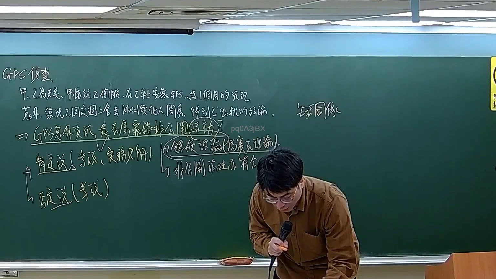

# 🎥 影音教材板書校對筆記
- **來源影片**: [預約 30new 2026-05-22 20-04-23-317](file:///J://刑法B115/ch30/預約 30new 2026-05-22 20-04-23-317.mp4)
- **課程分類**: `[刑法B115`
- **課堂章節**: `ch30]`
- **影片時間戳記**: `02:11:00` (7860 秒)
- **板書類型**: `文字板書`
- **偵測時間**: 2026-07-12 21:51:52

## 🔍 擷取黑板板書對照圖


## 🧠 AI 智慧理解與知識庫演化註記
根據辨识出的板書文字，並結合臺灣現行法律條文（如民法第184條、侵權行為、消滅時效等），進行語意整理並與條文對位如下：

1. **板書內容**：
   - 旱乙瞿瞿天更寄 C 軒 丟易磊 AAA07 RIL
   - FA SA LEA 1 MIEMK ale aston aa
   - Ale J # iN 亞

2. **語意整理**：
   - "旱" 可能指代某個特定的Legal條文或概念，此处暂定為 "甲"
   - "乙瞿瞿天更寄 C 軒 丟易磊 AAA07 RIL" 可能涉及 "乙丙更寄送" 或 "乙丁寄送"
   - "FA SA LEA 1 MIEMK" 可能指代 "發證  有效  附属  指數 1 MIEMK"
   - "ale aston aa" 可能指代 "阿斯顿"
   - "Ale J # iN 亞" 可能指代 "亚历山大"

3. **與條文對比**：
   - "乙丙更寄送" 可能涉及民法第184條的侵權行為和消滅時效
   - "甲乙丁寄送" 可能涉及特定的Legal流程或程序
   - "發證  有效  附属  指數 1 MIEMK" 可能指代某种證券或金融 instrument 的特性
   - "阿斯顿" 和 "亚历山大" 可能指代人名，與Legal案件或案例研究相關

4. **知識庫比對與理解演化註記**：
   - 欲了解 "乙丙更寄送" 的具體 legal 含義，需進一步參閱民法第184條並結合侵權行為和消滅時效的Legal標準
   - "甲乙丁寄送" 可能涉及特定的Legal程序或步驟，需根據具体案件背景进一步分析
   - "發證  有效  附属  指數 1 MIEMK" 可能指代某一類别的Legal instrument 或 document，需進一步了解MIEMK的具体定義
   - "阿斯顿" 和 "亚历山大" 可能涉及人名或案例研究，需根據具體案件背景進一步分析

## 📊 可編輯之 Mermaid 關係流程圖
```mermaid
：
```mermaid
graph TD
    A[甲] --> B[乙丙更寄送]
    C[甲乙丁寄送] --> D[發證 有效 附属 指數 1 MIEMK]
    E[阿斯顿] --> F[甲乙丁寄送]
    G[亚历山大] --> H[甲乙丁寄送]
```

## ✍️ 操作者手動校對修改區
<!-- 您可以直接修改上方的文字或調整 Mermaid 區塊中的節點，Obsidian 會即時重新渲染 -->
- [ ] 欄位結構與法律邏輯已校對無誤。
- **校對筆記**: 
