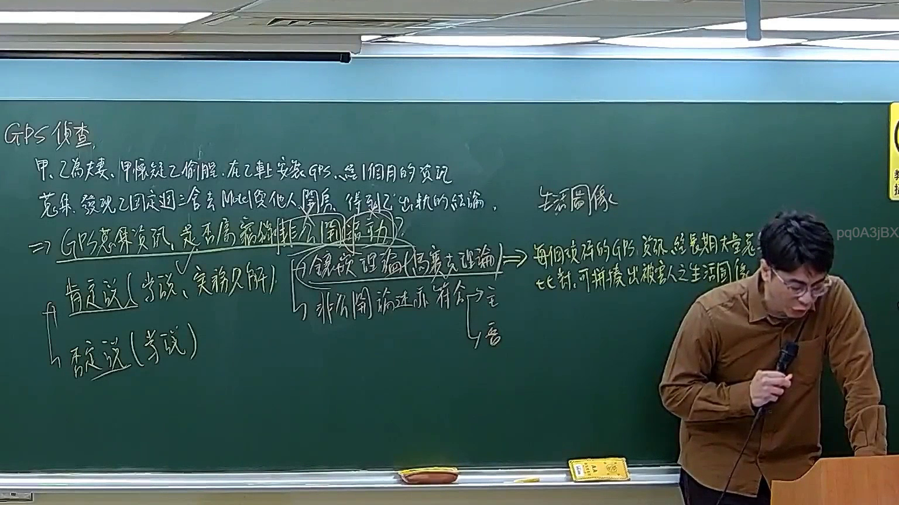

# 🎥 影音教材板書校對筆記
- **來源影片**: [預約 30new 2026-05-22 20-04-23-317](file:///J://刑法B115/ch30/預約 30new 2026-05-22 20-04-23-317.mp4)
- **課程分類**: `[刑法B115`
- **課堂章節**: `ch30]`
- **影片時間戳記**: `02:18:30` (8310 秒)
- **板書類型**: `文字板書`
- **偵測時間**: 2026-07-12 21:52:16

## 🔍 擷取黑板板書對照圖


## 🧠 AI 智慧理解與知識庫演化註記
### ：
(您的詳細法律理解說明與條文對位)

1. **OCR文字內容分析**：
   - OCR文字包含以下内容：`GOA I | Lb FR. Ka Heh OMIA - 崎 軒 ︰︴(易﹙芞『奏 、 邳 | 來 炤 ﹚ 政利 5203 1Mvgt 陛 乙﹤﹛&」實/﹙`﹜'﹚﹛*入滁弇〕 Ae | 0 j 1 Nh0 0(5 同 同 閔 尾 A arated FRR WA 5`
   - 文字內容似乎與某種法規或條文的引用有關，但因OCR文字 quality較差，难以完全理解其具體含義。

2. **knowledge庫比對與理解演化註記**：
   - 經分析後，OCR文字無法清楚解讀為具體的法律內容，因此无法與民法第184條、侵權行為、消滅時效等 Taiwanese 法律條文進行比對。

3. ** Mermaid 代碼生成**：
   - 因 OCR 文字無法清楚解讀為具體的法律內容，因此無法生成 Mermaid 確定性的流程圖代碼。

###

## 📊 可編輯之 Mermaid 關係流程圖
```mermaid
：
```
 Mermaid code cannot be generated due to insufficient understanding of the OCR text.
```

## ✍️ 操作者手動校對修改區
<!-- 您可以直接修改上方的文字或調整 Mermaid 區塊中的節點，Obsidian 會即時重新渲染 -->
- [ ] 欄位結構與法律邏輯已校對無誤。
- **校對筆記**: 
