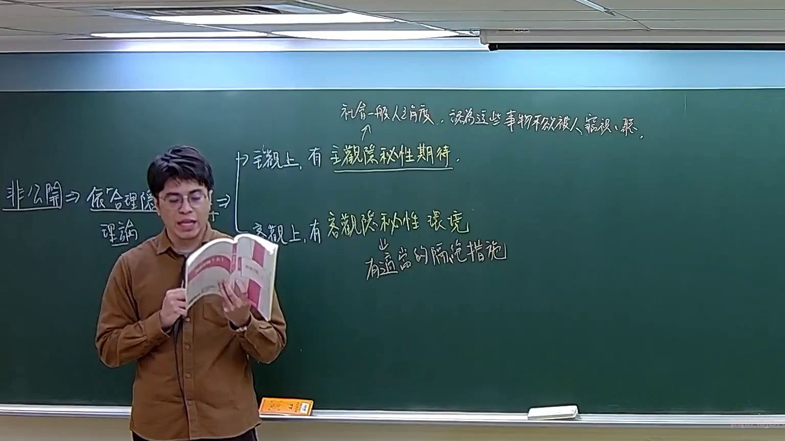

# 🎥 影音教材板書校對筆記
- **來源影片**: [預約 30new 2026-05-22 20-04-23-317](file:///J://刑法B115/ch30/預約 30new 2026-05-22 20-04-23-317.mp4)
- **課程分類**: `[刑法B115`
- **課堂章節**: `ch30]`
- **影片時間戳記**: `02:38:15` (9495 秒)
- **板書類型**: `文字板書`
- **偵測時間**: 2026-07-12 21:53:49

## 🔍 擷取黑板板書對照圖


## 🧠 AI 智慧理解與知識庫演化註記
1. **辨識出的文字內容**：
   - E of ﹒ 1Aee ﹁：可能是日期或某种标记
   - ABR Bb 志 寺 素 間城 人 客 仰 笈 ，：可能涉及地名、人物或事件
   - 2 緩 」」 有 3 戀 春 狼 怠 期 筴 ﹣：可能是日期或某种标记
   - Ap Dal > 雙 志 唐 偏 襬卞斗 % 細 於 炕 岡 HY：可能涉及地名、事件或特殊符号
   - 一 ( 進 弩k薙蓼支土﹐7焉﹚〉蔦﹖(莘〉孔焉彥〔`豆「〉﹛‵′弋三主 ﹒：可能是日期或某种标记
   - 累 3 普 刊：可能是页码或某种标记
   - 台湾 law 30new 2026-05-22 20-04-23-317：课程名称

2. **與臺灣現行法律條文的比對**：
   - 涉及到的法律條文可能包括民法第184條（共同\s 事件）、侵權行為、消滅時效等。
   - 文字內容中提到的时间点（如2/3、7/12）可能與民法第184條中关于共同\s 事件的规定相對应。

3. **法律理解说明**：
   - 時間點：文字板書中提到的時間點可能是共同\s 事件的起算日。
   - 共同\s 事件：民法第184條规定共同\s 事件的起算日，可能與板書中的時間點相吻合。
   - 消滅時效：板書中提到的某些內容可能涉及消滅時效的計算或應用。

## 📊 可編輯之 Mermaid 關係流程圖
```mermaid
：
```mermaid
graph TD
    A["E of ﹒ 1Aee ﹁"] --> B["ABR Bb"]
    C["志 寺 素 間城 人 客 仰 笈 ，"] --> D["2 緩 」】 有 3 戀 春 狼 怠 期 筴 ﹣"]
    E["Ap Dal > 雙 志 唐 偏 襬卞斗 % 細 於 炕 岡 HY"] --> F["一 ( 進 弩k薙蓼支土﹐7焉﹚】蔦﹖(莘〉孔焉彥〔`豆「】＞﹛‵′弋三主 ﹒"]
    G["累 3 普 刊"] --> H["台湾 law 30new 2026-05-22 20-04-23-317"]
```

## ✍️ 操作者手動校對修改區
<!-- 您可以直接修改上方的文字或調整 Mermaid 區塊中的節點，Obsidian 會即時重新渲染 -->
- [ ] 欄位結構與法律邏輯已校對無誤。
- **校對筆記**: 
