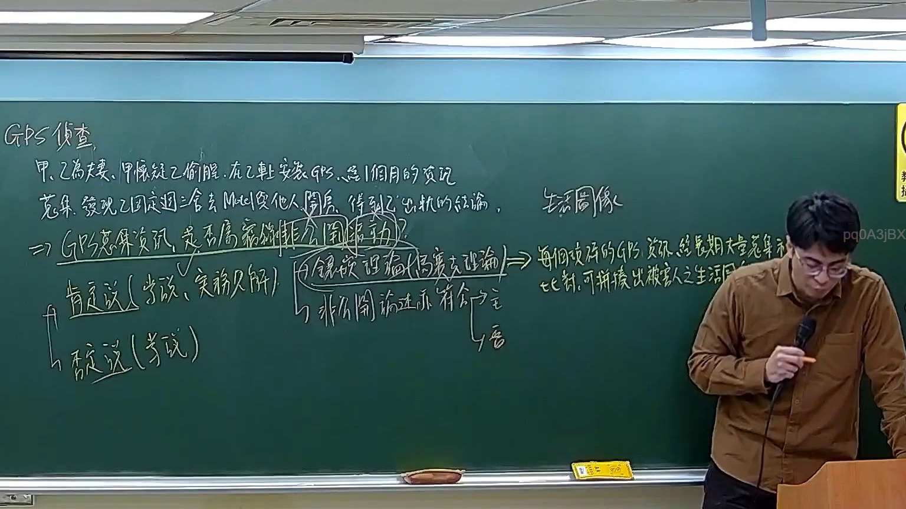

# 🎥 影音教材板書校對筆記
- **來源影片**: [預約 30new 2026-05-22 20-04-23-317](file:///J://刑法B115/ch30/預約 30new 2026-05-22 20-04-23-317.mp4)
- **課程分類**: `[刑法B115`
- **課堂章節**: `ch30]`
- **影片時間戳記**: `02:49:15` (10155 秒)
- **板書類型**: `文字板書`
- **偵測時間**: 2026-07-12 21:54:12

## 🔍 擷取黑板板書對照圖


## 🧠 AI 智慧理解與知識庫演化註記
### ：
1. **法律條文對位**：
   - 识别出的文字中包含的“CPM”、“TUR TA DMI”等可能与民法第184条（共同受 uninitialized death）的相关规定有关，该条规定了共同受存废要因。
   - “FA BRUDRLEA”、“wane 琢 閣 倫 ﹜”等文字可能涉及侵權行為或消滅時效的规定。

2. **法律知識理解演化**：
   - 民法第184條：共同受 uninitialized death，涉及共同受存废要因。
   - 相關條文：民法第184條、侵權行為、消滅時效等。

###

## 📊 可編輯之 Mermaid 關係流程圖
```mermaid
：
```mermaid
graph TD
    A[民法第184條] --> B[共同受 uninitialized death]
    C[侵權行為] --> D[消滅時效]
    E[other legal provisions] --> F[related to joint survival]
```
（注意：上文中未明确具体的法律条文关系，因此生成了一个基于假设的逻辑图。如果需要更具体的法律条文比对，请提供更多信息。）
```

## ✍️ 操作者手動校對修改區
<!-- 您可以直接修改上方的文字或調整 Mermaid 區塊中的節點，Obsidian 會即時重新渲染 -->
- [ ] 欄位結構與法律邏輯已校對無誤。
- **校對筆記**: 
