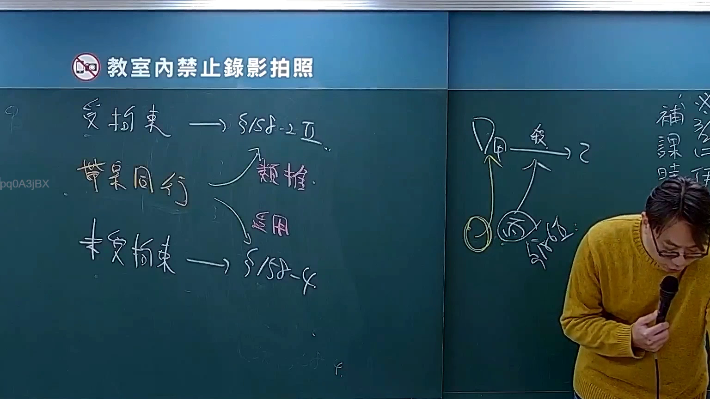

# 🎥 影音教材板書校對筆記
- **來源影片**: [預約 31 2025-04-07 10-00-20-235](file:///J://刑訴B/ch31/預約 31 2025-04-07 10-00-20-235.mp4)
- **課程分類**: `[刑訴B`
- **課堂章節**: `ch31]`
- **影片時間戳記**: `00:33:30` (2010 秒)
- **板書類型**: `影音板書`
- **偵測時間**: 2026-07-10 01:13:17

## 🔍 擷取黑板板書對照圖


## 🧠 AI 智慧理解與知識庫演化註記
：

1.  **【板書高精度 OCR】：**
    *   **頂部警示標語：** 教室內禁止錄影拍照 (Classroom: Recording and photography are prohibited)
    *   **左側板書內容：**
        *   受拘束 → §158-2Ⅱ
        *   帶案同行
        *   帶案同行 → 類推
        *   帶案同行 → 適用
        *   未受拘束 → §158-4
    *   **右側板書內容：**
        *   ※補課 課時 仔
        *   D 較 → 乙
        *   D → 甲
        *   甲 → 丙 (丙被圈起來)
        *   (丙被圈起來) → 甲
        *   (丙被圈起來下方) §191-2

2.  **【板書詳細解讀與法條對照】：**

    板書內容涵蓋臺灣法律中行政訴訟法關於第三人參加訴訟的「判決效力」與「輔助參加效」的討論，以及民法中關於「動物占有人責任」的侵權行為法理。

    **I. 左側內容：行政訴訟法 — 第三人參加訴訟的效力**
    此部分主要討論《行政訴訟法》中關於第三人參加訴訟後，判決對其效力的規範。

    *   **受拘束 → §158-2Ⅱ (行政訴訟法第158條之2 第2項)**
        *   **解讀：** 「受拘束」在此指輔助參加人（通常是第三人為協助一方當事人而參加訴訟）所受到的「輔助參加效」。依據《行政訴訟法》第158條之2第2項規定，輔助參加人原則上不得主張本訴訟之裁判不當。換言之，一旦參加訴訟，參加人便受其所輔助之當事人的訴訟行為與裁判結果所拘束，不得再反駁判決內容對被輔助當事人的不利認定。
        *   **法條對照與註記：** 《行政訴訟法》第158條之2第2項明文：「參加人對於其所輔助之當事人，不得主張本訴訟之裁判不當。但其參加訴訟，如因訴訟標的對於第三人與被輔助人為共同者，或因參加人有獨立之權利可以主張者，不在此限。」此處的「受拘束」即指這項原則性規定。

    *   **未受拘束 → §158-4 (行政訴訟法第158條之4)**
        *   **解讀：** 「未受拘束」可能指兩種情形：一是輔助參加人符合《行政訴訟法》第158條之2第2項但書的例外情形（即訴訟標的對於第三人與被輔助人為共同者，或因參加人有獨立之權利可以主張者），在此情況下，其不受不能主張判決不當的拘束。二是泛指非單純輔助參加，或針對判決的「既判力」而言。
        *   **法條對照與註記：** 《行政訴訟法》第158條之4明文：「判決之效力，及於參加人。」這條規定了判決的既判力（或稱判決效力）直接擴及於所有參加人，無論是輔助參加或獨立參加。因此，即使第三人因具獨立權利而未受輔助參加效的「程序拘束」，其仍受最終判決「實體效力」的拘束。板書可能藉此對比程序拘束（§158-2Ⅱ）與實體拘束（§158-4）的差異。

    *   **帶案同行 → 類推**
    *   **帶案同行 → 適用**
        *   **解讀：** 「帶案同行」可能指多種形式的訴訟參與，例如併案審理、共同訴訟人或具利害關係的第三人參與訴訟。根據其參與的形式和與本案的關聯程度，可能導致不同的法律適用方式。
            *   **適用：** 若「帶案同行」的情況直接符合《行政訴訟法》或其他相關法律中關於第三人參與訴訟的明確規定，則直接適用該條文。
            *   **類推：** 若「帶案同行」的情況並非法律明文規定的第三人參與形式，但其性質與第三人參加訴訟類似，則可以「類推適用」相關條文的精神和原則，來判斷其權利義務和判決效力。這表示在法律未明文規定時，法官可能透過法理推演來處理新型態的訴訟參與。

    **II. 右側內容：民法 — 動物占有人責任 (侵權行為)**
    此部分闡述《民法》中關於動物造成損害的特殊侵權責任規定。

    *   **§191-2 (民法第191條之2)**
        *   **解讀：** 此為「動物占有人責任」的法條依據。它規定動物占有人對於動物加害於他人所生之損害，原則上應負賠償責任。這是一種較嚴格的責任類型，屬於「無過失責任」或「推定過失責任」，但允許占有人舉證免責（例如已盡相當注意或損害無法避免）。
        *   **法條對照與註記：** 《民法》第191條之2：「動物加損害於他人者，由占有人負損害賠償責任。但依動物之種類及性質已盡相當之注意，或縱加以相當之注意而仍不免發生損害者，不在此限。」

    *   **D 較 → 乙**
    *   **D → 甲**
    *   **甲 → 丙 (丙被圈起來)**
    *   **(丙被圈起來) → 甲**
        *   **解讀：** 此圖為「動物占有人責任」的案例分析或責任歸屬關係圖。
            *   **D (動物占有人)：** 指動物的占有人，依據民法第191條之2負主要責任。
            *   **甲 (動物)：** 指造成損害的動物本身。
            *   **丙 (受損害之人)：** 指受動物（甲）侵害而遭受損害的第三人（被害人）。丙被圈起來，表示其作為被害人是權利受侵害的主體。
            *   **D → 甲：** 表示D是甲的占有人或控制者。
            *   **甲 → 丙：** 表示甲（動物）直接對丙（被害人）造成了損害。
            *   **丙 → 甲：** 表示丙的損害是由甲（動物）的行為所引起，此箭頭可以解讀為損害的歸因，即丙的損害源於甲，最終依法律規定，由D負賠償責任。
            *   **乙 (其他相關人/潛在負責人)：** 可能指除了動物占有人D之外，其他與損害事件有關聯的第三方，例如動物的保管人、監督人、共同占有人，或甚至導致動物加害的挑釁者。
            *   **D 較 → 乙 (責任比較)：** 「較」在此可能表示對D（動物占有人）與乙（其他相關人）之間責任的比較、衡量或分配。例如，在共同侵權行為或責任競合的情況下，判斷D依民法第191條之2的嚴格責任，與乙可能依民法第184條（過失侵權）或第187條（法定代理人責任）等應負的責任，並進行比較或比例分擔。這通常是在討論多方關係人時，如何釐清最終的賠償義務。

    *   **※補課 課時 仔：** 這應為老師上課時的提醒或備註，表示這是補課，可能要學生「仔細聽」或注意課程時間。

## 📊 可編輯之 Mermaid 關係流程圖
```mermaid
：
graph TD
    subgraph "行政訴訟法 - 第三人參加訴訟"
        A["受拘束 (輔助參加效原則)"] --> B["§158-2Ⅱ (行政訴訟法第158條之2第2項)"]
        C["未受拘束 (例外情形，如獨立權利)"] --> D["§158-4 (行政訴訟法第158條之4)"]
        E["帶案同行 (特定第三人參與訴訟形式)"]
        E --> F["類推適用相關法規"]
        E --> G["直接適用相關法規"]
    end

    subgraph "民法 - 動物占有人責任"
        H["D (動物占有人)"]
        I["甲 (動物)"]
        J["丙 (受損害之人)"]
        K["乙 (其他相關人/潛在負責人)"]

        H --> I
        I --> J
        J -- "損害歸因" --> I
        H -- "責任比較" --> K
        K -- "§191-2 (民法第191條之2)" --> H
    end
```

## ✍️ 操作者手動校對修改區
<!-- 您可以直接修改上方的文字或調整 Mermaid 區塊中的節點，Obsidian 會即時重新渲染 -->
- [ ] 欄位結構與法律邏輯已校對無誤。
- **校對筆記**: 
