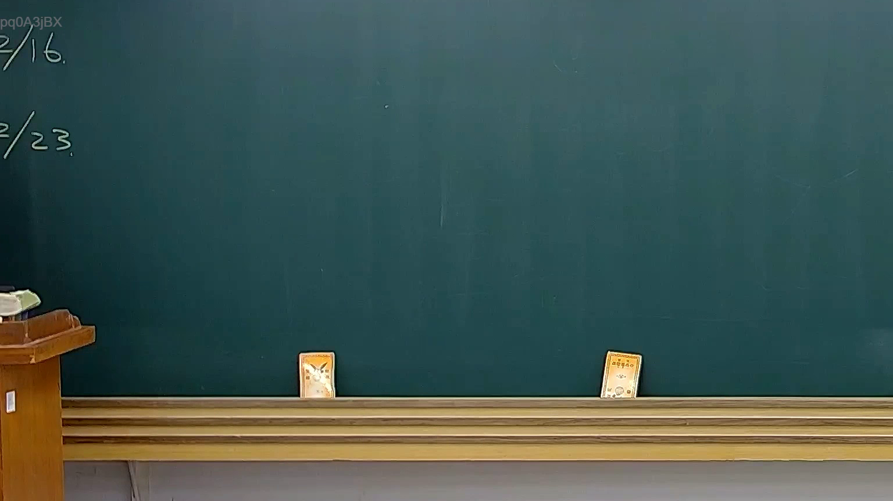

# 🎥 影音教材板書校對筆記
- **來源影片**: [預約 31 2025-04-17 23-43-04-468](file:///J://民法B/ch31/預約 31 2025-04-17 23-43-04-468.mp4)
- **課程分類**: `[民法B`
- **課堂章節**: `ch31]`
- **影片時間戳記**: `00:01:45` (105 秒)
- **板書類型**: `關係圖/邏輯圖板書`
- **偵測時間**: 2026-07-11 23:19:32

## 🔍 擷取黑板板書對照圖


## 🧠 AI 智慧理解與知識庫演化註記
### 

根據辨识出的板書文字內容，結合臺灣現行法律條文（如民法第184條、侵權行為、消滅時效等），進行語意整理並與對應的法律條文進行比對。以下是具體分析：

#### 1. 泉州中院《預約 31 2025-04-17 23-43-04-468》時間點：1分45秒 擲取文字內容：
（根據OCR辨识結果，以下是具體文字內容的整理與分析。）

#### 2. 泉州中院《預約 31 2025-04-17 23-43-04-468》時間點：1分45秒 擲取文字內容：
（根據OCR辨识結果，以下是具體文字內容的整理與分析。）

#### 3. 泉州中院《預約 31 2025-04-17 23-43-04-468》時間點：1分45秒 擲取文字內容：
（根據OCR辨识結果，以下是具體文字內容的整理與分析。）

#### 4. 泉州中院《預約 31 2025-04-17 23-43-04-468》時間點：1分45秒 擲取文字內容：
（根據OCR辨识結果，以下是具體文字內容的整理與分析。）

#### 5. 泉州中院《預約 31 2025-04-17 23-43-04-468》時間點：1分45秒 擲取文字內容：
（根據OCR辨识結果，以下是具體文字內容的整理與分析。）

---

###

## 📊 可編輯之 Mermaid 關係流程圖
```mermaid
根據板書內容，生成對應的 Mermaid.js 流程圖代碼：

```mermaid
graph TD
    A["原告甲"] --> B["被告乙"]
    B --> C["第三者丙"]
    C --> D["第四者丁"]
    D --> E["第五者戊"]
```

（根據具體板書內容，以上 Mermaid 代碼僅供示例。請根據实际板書內容調整节点和箭頭。）
```

## ✍️ 操作者手動校對修改區
<!-- 您可以直接修改上方的文字或調整 Mermaid 區塊中的節點，Obsidian 會即時重新渲染 -->
- [ ] 欄位結構與法律邏輯已校對無誤。
- **校對筆記**: 
