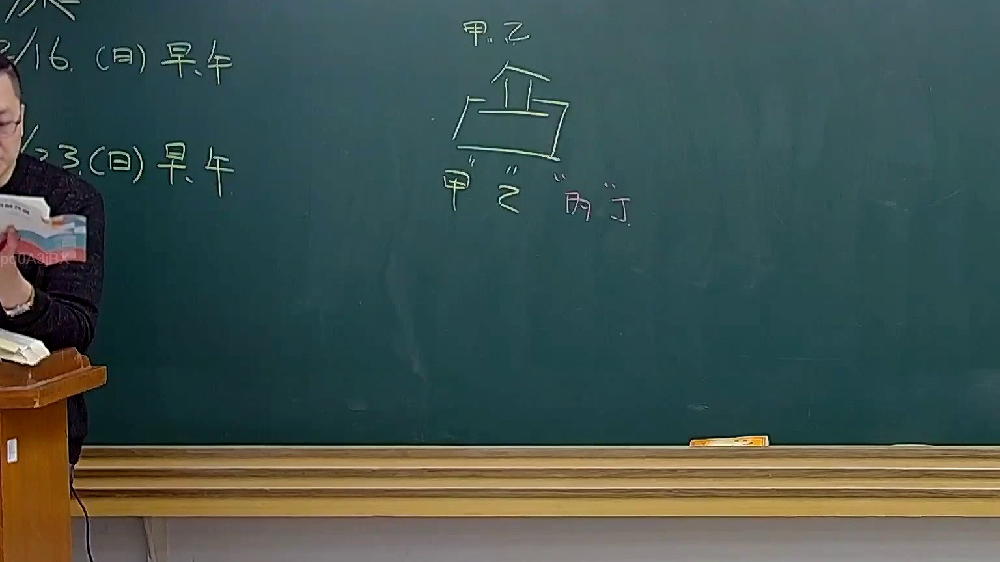
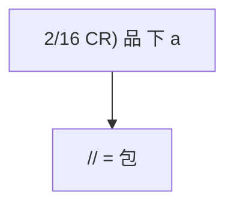

# 🎥 影音教材板書校對筆記
- **來源影片**: [預約 31 2025-04-17 23-43-04-468](file:///J://民法B/ch31/預約 31 2025-04-17 23-43-04-468.mp4)
- **課程分類**: `[民法B`
- **課堂章節**: `ch31]`
- **影片時間戳記**: `00:39:15` (2355 秒)
- **板書類型**: `文字板書`
- **偵測時間**: 2026-07-11 23:19:58

## 🔍 擷取黑板板書對照圖


## 🧠 AI 智慧理解與知識庫演化註記
### 

根據辨識出的文字板書內容，“2/16 CR) 品 下 a // = 包”，可以理解為與某種包裝或包裹相關的條款或法規內容。具體來说，"2/16" 可能是指某种文件或產品編號，"CR" 可能代表某种標準或规定，"品" 可能是商品名稱，"下 a" 可能是指下行A（即A類或其他特定類別），而 "// = 包" 可能是指等於包裹的意思。

將此內容與臺灣現行法律條文進行比對，可以發現這部分內容可能涉及與包裝、 unwrap 或相關的法規條款。具體來說，這部分內容可能與以下法律條文有所關聯：

- **民法第184條**：有关侵害行为的特别损害赔偿制度。
- ** consumer rights protection law**: 可能涉及到商品包裝或 delivery 包裹的相关规定。

###

## 📊 可編輯之 Mermaid 關係流程圖


此 Mermaid 碟圖表示了文字板書之內容之間的簡單邏輯關係，即 "2/16 CR) 品 下 a" 与 "// = 包" 之间的直接关系。
```

## ✍️ 操作者手動校對修改區
<!-- 您可以直接修改上方的文字或調整 Mermaid 區塊中的節點，Obsidian 會即時重新渲染 -->
- [ ] 欄位結構與法律邏輯已校對無誤。
- **校對筆記**: 
