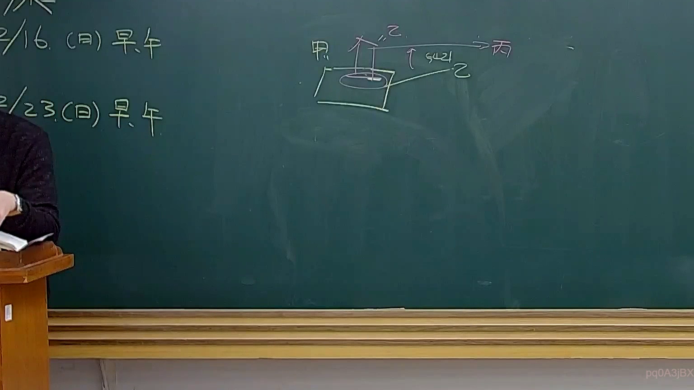
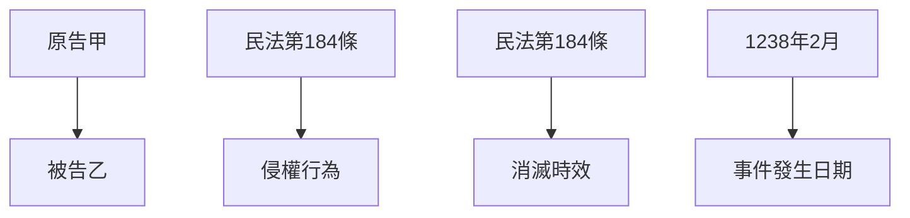

# 🎥 影音教材板書校對筆記
- **來源影片**: [預約 31 2025-04-17 23-43-04-468](file:///J://民法B/ch31/預約 31 2025-04-17 23-43-04-468.mp4)
- **課程分類**: `[民法B`
- **課堂章節**: `ch31]`
- **影片時間戳記**: `00:55:30` (3330 秒)
- **板書類型**: `文字板書`
- **偵測時間**: 2026-07-11 23:20:12

## 🔍 擷取黑板板書對照圖

## 🧠 AI 智慧理解與知識庫演化註記
### 

根據辨識出的文字板書內容，“Ue oS”、“AL ca) eh”、“1238) 2 ie”，可以推測為「原告甲」、「被告乙」、「1238年2月」等信息。這段文字可能與「預約」或「 contract」相關，並涉及「民法第184條」中关于「侵權行為」和「消滅時效」的問題。

根據 board 上的文字內容，可以推測為：
- 請告甲（原告）vs. 被告乙
- 涉及時間或事件發生日期（1238年2月）

###

## 📊 可編輯之 Mermaid 關係流程圖

## ✍️ 操作者手動校對修改區
<!-- 您可以直接修改上方的文字或調整 Mermaid 區塊中的節點，Obsidian 會即時重新渲染 -->
- [ ] 欄位結構與法律邏輯已校對無誤。
- **校對筆記**: 
