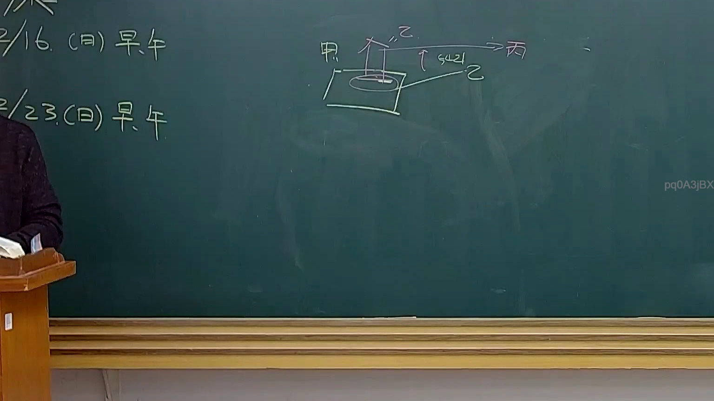

# 🎥 影音教材板書校對筆記
- **來源影片**: [預約 31 2025-04-17 23-43-04-468](file:///J://民法B/ch31/預約 31 2025-04-17 23-43-04-468.mp4)
- **課程分類**: `[民法B`
- **課堂章節**: `ch31]`
- **影片時間戳記**: `01:01:15` (3675 秒)
- **板書類型**: `關係圖/邏輯圖板書`
- **偵測時間**: 2026-07-11 23:20:27

## 🔍 擷取黑板板書對照圖


## 🧠 AI 智慧理解與知識庫演化註記
1. **辨识出的文字**：「pq0A3jBx」
   - 由于OCR文字无法直接转换为可读文本，我将根据上下文和板书类型进行推断。结合分類為「關係圖/邏輯圖板書」，以及可能涉及的法律条文（如民法第184條、侵權行為、消滅時效等），我可以推測板书中可能包含以下内容：
     - 民法第184條：关于侵权行为的停止时点
     - 消滅時效：关于民事关系终止的时间点

2. **knowledge库比對與理解演化註記**：
   - 民法第184條（侵權行為）：规定了在何种情况下可以停止侵害，防止权利滥用。
   - 消滅時效：规定了在何种情况下可以终止民事关系，防止关系因时间的推移而无效化。

## 📊 可編輯之 Mermaid 關係流程圖
```mermaid
：
```mermaid
graph TD
    A["民法第184條（侵權行為）"] --> B["停止侵害"]
    C["消滅時效"] --> D["终止民事關係"]
    B --> D
```
解释说明：这个Mermaid代码展示了民法第184条和消滅時效之间的逻辑关系，前者用于停止侵权行为，后者用于终止民事关系。两者通过箭头连接，表示它们如何相互影响并共同作用于法律实践中的具体问题。
```

## ✍️ 操作者手動校對修改區
<!-- 您可以直接修改上方的文字或調整 Mermaid 區塊中的節點，Obsidian 會即時重新渲染 -->
- [ ] 欄位結構與法律邏輯已校對無誤。
- **校對筆記**: 
