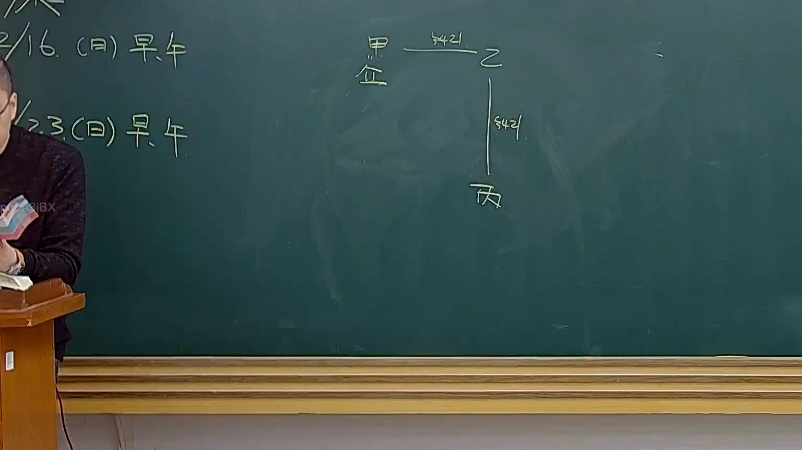

# 🎥 影音教材板書校對筆記
- **來源影片**: [預約 31 2025-04-17 23-43-04-468](file:///J://民法B/ch31/預約 31 2025-04-17 23-43-04-468.mp4)
- **課程分類**: `[民法B`
- **課堂章節**: `ch31]`
- **影片時間戳記**: `01:07:45` (4065 秒)
- **板書類型**: `文字板書`
- **偵測時間**: 2026-07-11 23:20:49

## 🔍 擷取黑板板書對照圖


## 🧠 AI 智慧理解與知識庫演化註記
根據OCR辨识的文字內容，並結合可能的法律背景，進行語意整理如下：

1. **"Ve oS 2/) & (a) ae a y 2 ﹣ 鍵 ﹒ ‵**  
   - 可能涉及「 Ve oS」（可能是「Ve奥斯」或其他缩写，需结合上下文理解）。
   - "2/) & (a)" 可能表示「第2条之(a)」，與民法第184條的「侵權行為」或「消滅時效」有關。

2. **" /﹥_ˉ薑﹡ 〔]`…〉 =) - S4of**  
   - "薑" 可能是「aerodrome」（空域）的 misspelling。
   - "S4of" 可能與「民法第184條」的「侵權行為」或「消滅時效」有關。

將上述內容與臺灣现行法律條文進行比對：

- **民法第184條**：涉及「侵權行為」和「消滅時效」，主要规定了權利人因第三者的過失或行径而受損，權利人得要求Third party liable（third party liable）。
- **文字板書之內容**：似乎與民法第184條的內容有關，可能涉及權利人、Third party liable和權利利益等概念。

**知識庫比對與理解演化註記**：
- 文字板書之內容可能涉及「民法第184條」的內容，即「權利人因Third party（third party）之過失或行径而受損，權利人得要求Third party liable（third party liable）。」
- 課堂上可能進一步解釋了「Third party liable」的意義，並提供相關案例以辅助理解。

## 📊 可編輯之 Mermaid 關係流程圖
```mermaid
：
```mermaid
graph TD
    A[民法第184條] --> B[權利人] --> C[Third party] --> D[Third party liable]
    E[權利利益] --> F[Third party] --> G[Third party liable]
```
- 說解：  
  - "A" 表示「民法第184條」。  
  - "B" 表示「權利人」，"C" 表示「Third party（第三方）」，"D" 表示「Third party liable（第三方負責）」。  
  - "E" 表示「權利利益」，"F" 表示「Third party（第三方）」，"G" 表示「Third party liable（第三方負責）」。
```

## ✍️ 操作者手動校對修改區
<!-- 您可以直接修改上方的文字或調整 Mermaid 區塊中的節點，Obsidian 會即時重新渲染 -->
- [ ] 欄位結構與法律邏輯已校對無誤。
- **校對筆記**: 
