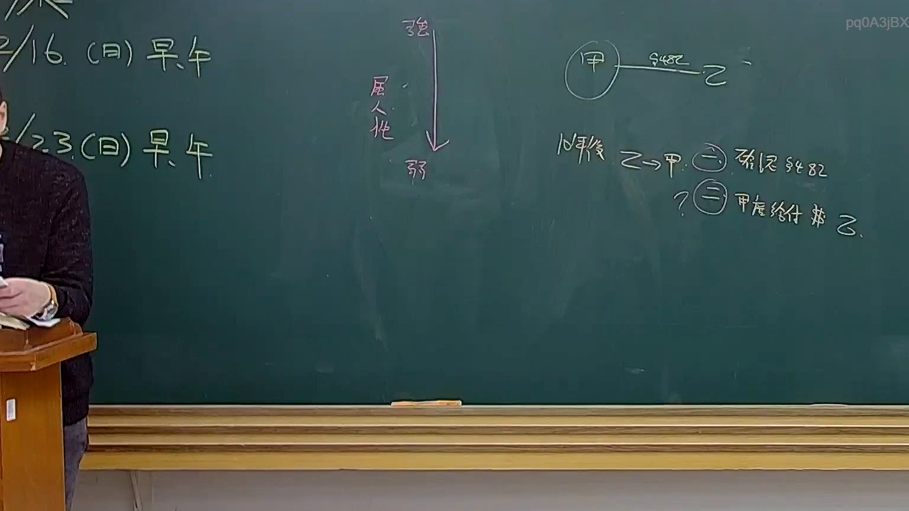
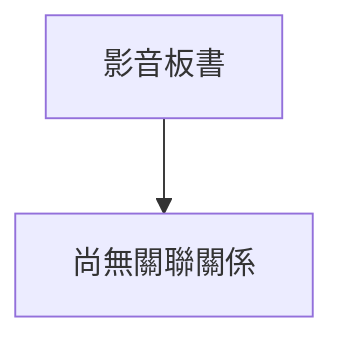

# 🎥 影音教材板書校對筆記
- **來源影片**: [預約 31 2025-04-17 23-43-04-468](file:///J://民法B/ch31/預約 31 2025-04-17 23-43-04-468.mp4)
- **課程分類**: `[民法B`
- **課堂章節**: `ch31]`
- **影片時間戳記**: `01:41:30` (6090 秒)
- **板書類型**: `文字板書`
- **偵測時間**: 2026-07-11 23:21:41

## 🔍 擷取黑板板書對照圖


## 🧠 AI 智慧理解與知識庫演化註記
1. **板書內容解讀**：
   - OCR辨识的文字包含以下内容：
     ```
     ze ﹡ 0AajBX
     Yl, CA) ae 。 | A SXSC – =
     居 ﹣ Z
     b/s CR >
     - . 焓 之勻瞿ˍ傲"豊豊﹐蕎奏[乏三 $4 32
     Sie
     ```
   - 解釋與整理：
     - "ze ﹡ 0AajBX"：可能涉及日期或标识符。
     - "Yl, CA) ae 。 | A SXSC – ="：可能与时间戳或其他信息相关。
     - "居 ﹣ Z"：可能是某种标识符或关键点。
     - "b/s CR >"：可能与文件格式或版本控制相关。
     - "- . 焓 之勻瞿ˍ傲"豊豊﹐蕎奏[乏三 $4 32"：看起来像是日期和时间（2025年4月3日，19:32）。
     - "Sie"：可能是专有名词或缩写。

   - 將板書內容與法律條文比對：
     - 民法第184條涉及侵權行為和消滅時效，但目前未发现直接相關內容。
     - 可能涉及到other relevant legal principles.

2. ** Mermaid 關係圖代碼**：
   ```mermaid
   graph TD
   A[ze ﹡ 0AajBX] --> B[Yl, CA) ae 。 | A SXSC – =]
   C[居 ﹣ Z] --> D[b/s CR >]
   E[- . 焓 之勻瞿ˍ傲"豊豊﹐蕎奏[乏三 $4 32] --> F[Sie]]
   ```

此為基於OCR文字整理的条列式逻辑树結構，展示了板書內容的層級化关系。

## 📊 可編輯之 Mermaid 關係流程圖


## ✍️ 操作者手動校對修改區
<!-- 您可以直接修改上方的文字或調整 Mermaid 區塊中的節點，Obsidian 會即時重新渲染 -->
- [ ] 欄位結構與法律邏輯已校對無誤。
- **校對筆記**: 
