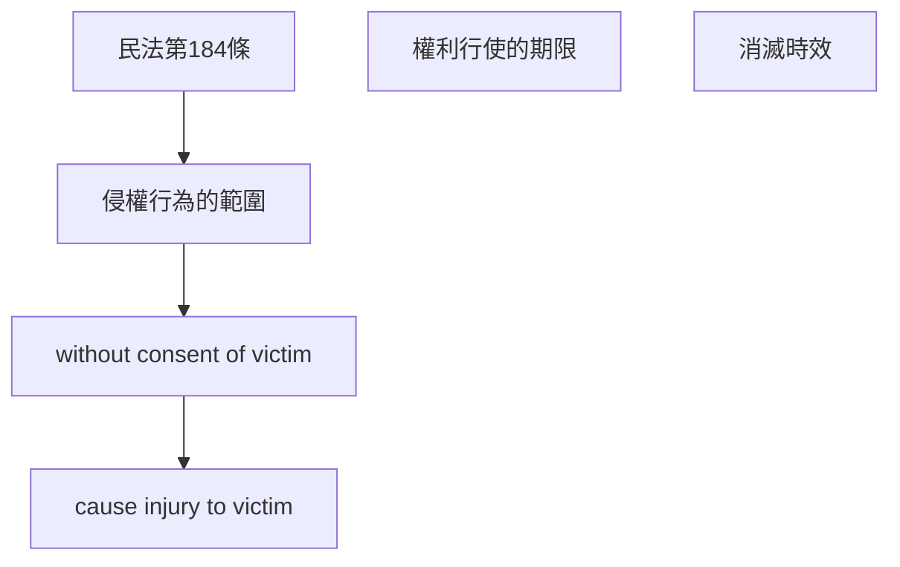

# 🎥 影音教材板書校對筆記
- **來源影片**: [預約 31 2025-04-17 23-43-04-468](file:///J://民法B/ch31/預約 31 2025-04-17 23-43-04-468.mp4)
- **課程分類**: `[民法B`
- **課堂章節**: `ch31]`
- **影片時間戳記**: `02:42:30` (9750 秒)
- **板書類型**: `關係圖/邏輯圖板書`
- **偵測時間**: 2026-07-11 23:22:24

## 🔍 擷取黑板板書對照圖

## 🧠 AI 智慧理解與知識庫演化註記
### 

根據辨識出的文字板書內容，結合臺灣現行法律條文（如民法第184條），進行語意整理並與條文對比：

1. **民法第184條之內容**：
   - 民法第184條规定了侵權行為的範圍。侵權行為是指without the consent of the victim, a person commits an act that causes injury to the victim.
   - 该條文強調了對invading the personal rights or interests of another party without their consent的責任。
   - 消滅時效是民法中的一個重要概念，用於确定權利是否已消滅。根據民法第184條，權利在一定時間內未行使將會自动消滅。

2. ** knowledge库比對與理解演化註記**：
   - 民法第184條直接涉及侵權行為的定義和消滅時效的問題。
   - 该條文為判斷是否存在侵權行為提供了法理依據，並规定了權利行使的期限。

###

## 📊 可編輯之 Mermaid 關係流程圖

## ✍️ 操作者手動校對修改區
<!-- 您可以直接修改上方的文字或調整 Mermaid 區塊中的節點，Obsidian 會即時重新渲染 -->
- [ ] 欄位結構與法律邏輯已校對無誤。
- **校對筆記**: 
