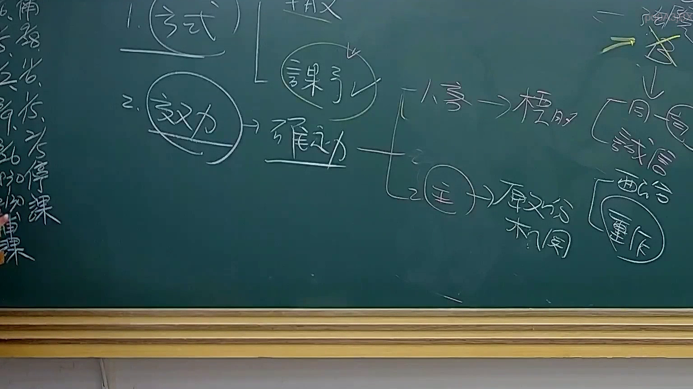
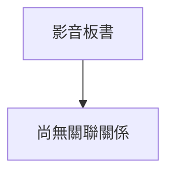

# 🎥 影音教材板書校對筆記
- **來源影片**: [預約 31 2025-08-06 16-29-38-044](file:///J://行政法A/ch31/預約 31 2025-08-06 16-29-38-044.mp4)
- **課程分類**: `[行政法A`
- **課堂章節**: `ch31]`
- **影片時間戳記**: `00:46:30` (2790 秒)
- **板書類型**: `關係圖/邏輯圖板書`
- **偵測時間**: 2026-07-13 12:41:56

## 🔍 擷取黑板板書對照圖

## 🧠 AI 智慧理解與知識庫演化註記
：

您好，感謝您的提問。不過在您的訊息中，OCR 辨識字元部分為空白——您寫了「擷取區域的 OCR 辨識字元如下：」但後續並未附上實際的文字內容。

因此我目前無法進行以下工作：
1. 語意整理與條文比對（如民法第184條侵權行為、消滅時效等）
2. 生成對應的 Mermaid.js 流程圖或邏輯樹

**請您補充提供 OCR 辨識出的文字內容**，我將立即為您完成：
- 板書文字的語意整理與臺灣現行法律條文比對註記
- 依分類（關係圖/邏輯圖 or 文字板書）生成完整的 Mermaid.js 代碼

期待您的回覆！

## 📊 可編輯之 Mermaid 關係流程圖

## ✍️ 操作者手動校對修改區
<!-- 您可以直接修改上方的文字或調整 Mermaid 區塊中的節點，Obsidian 會即時重新渲染 -->
- [ ] 欄位結構與法律邏輯已校對無誤。
- **校對筆記**: 
