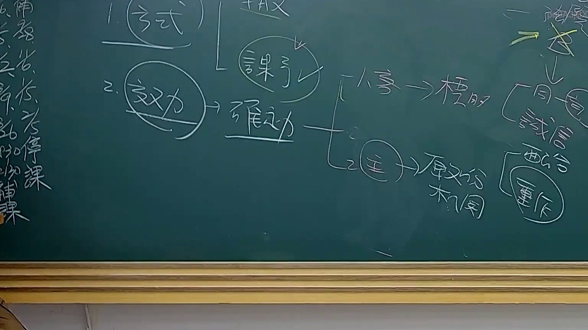
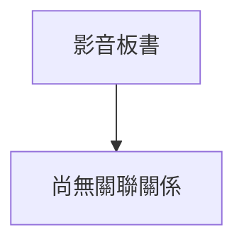

# 🎥 影音教材板書校對筆記
- **來源影片**: [預約 31 2025-08-06 16-29-38-044](file:///J://行政法A/ch31/預約 31 2025-08-06 16-29-38-044.mp4)
- **課程分類**: `[行政法A`
- **課堂章節**: `ch31]`
- **影片時間戳記**: `00:47:45` (2865 秒)
- **板書類型**: `關係圖/邏輯圖板書`
- **偵測時間**: 2026-07-13 12:42:17

## 🔍 擷取黑板板書對照圖

## 🧠 AI 智慧理解與知識庫演化註記
您好！我注意到您的訊息中「擷取區域的 OCR 辨識字元如下：」之後**沒有附上實際的文字內容**。

要完成以下工作，我需要您提供：

1. **OCR 辨識出的板書文字**（即使有錯別字或斷句問題也請一併貼上）
2. （如有）老師口述的相關語意補充

一旦收到 OCR 文字，我將立即為您執行：

- 📖 **知識庫比對與理解演化註記** — 比對民法第184條、侵權行為責任、消滅時效等現行法條
- 🌳 **Mermaid.js 流程圖代碼** — 依【關係圖/邏輯圖板書】分類，生成結構化圖表

請將 OCR 文字貼上，我馬上為您處理！

## 📊 可編輯之 Mermaid 關係流程圖

## ✍️ 操作者手動校對修改區
<!-- 您可以直接修改上方的文字或調整 Mermaid 區塊中的節點，Obsidian 會即時重新渲染 -->
- [ ] 欄位結構與法律邏輯已校對無誤。
- **校對筆記**: 
