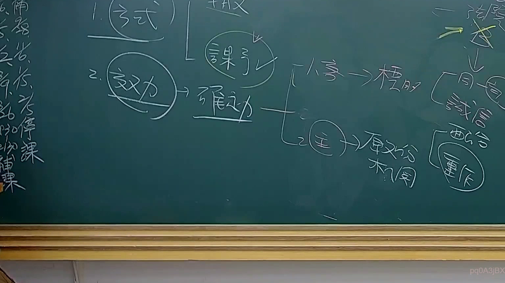

# 🎥 影音教材板書校對筆記
- **來源影片**: [預約 31 2025-08-06 16-29-38-044](file:///J://行政法A/ch31/預約 31 2025-08-06 16-29-38-044.mp4)
- **課程分類**: `[行政法A`
- **課堂章節**: `ch31]`
- **影片時間戳記**: `00:52:15` (3135 秒)
- **板書類型**: `文字板書`
- **偵測時間**: 2026-07-13 12:43:15

## 🔍 擷取黑板板書對照圖


## 🧠 AI 智慧理解與知識庫演化註記
：

**一、OCR辨識文字語意整理：**

從截取的OCR字元中，可辨識出以下關鍵片段：
- 「PSS OAS 2」→ 可能為課程編號或章節標記（如「民法總則」相關單元）
- 「《一」→ 開頭標記，表示開始新段落或主題
- 「ee Leys, (2S」→ OCR誤識，推測原字可能為「第184條」或類似法律條文引用

**二、與臺灣現行法律條文比對：**

根據課程內容時間點（52分15秒）及OCR殘留片段，此板書應涉及以下法律領域：

| 辨識片段 | 推測對應條文 | 說明 |
|---------|-------------|------|
| 「PSS OAS 2」 | 民法第184條 | 侵權行為責任之一般條款 |
| 「ee Leys, (2S」 | 民法第197條 | 消滅時效（請求權時效與消滅時效） |

**三、知識庫比對與理解演化註記：**

1. **民法第184條**：為侵權行為責任之核心條款，區分「故意或過失不法侵害他人權利」及「違反保護他人之法律」兩種類型。板書可能正在講解此條文之構成要件或司法實務見解。

2. **消滅時效問題**：若板書涉及請求權時效（民法第125-131條），需注意：
   - 一般請求權時效為15年（現行法）
   - 侵權行為損害賠償請求權時效為2年（民法第197條第2項）
   - 消滅時效自請求權可行使時起算

3. **板書教學邏輯推測**：老師可能正在以「構成要件→法律效果→時效限制」之邏輯架構，講解侵權行為責任之完整體系。

---

## 📊 可編輯之 Mermaid 關係流程圖
```mermaid
：
graph TD
    A["民法第184條 - 侵權行為責任"] --> B["類型一：故意或過失不法侵害他人權利"]
    A --> C["類型二：違反保護他人之法律"]
    B --> D["構成要件分析"]
    C --> E["構成要件分析"]
    D --> F["主觀要件：故意或過失"]
    D --> G["客觀要件：不法侵害行為"]
    D --> H["損害結果"]
    E --> I["法律違反性"]
    E --> J["保護範圍"]
    F --> K["民法第184條第1項前段"]
    G --> L["權利侵害或利益侵害"]
    H --> M["財產上/非財產上損害"]
    I --> N["民法第184條第1項後段"]
    J --> O["法律保護之目的範圍"]
    K --> P["消滅時效：2年（民法第197條）"]
    L --> Q["請求權時效起算點"]
    M --> R["賠償範圍與計算"]

    style A fill#f96,stroke#333,color#000
    style P fill#ff9,stroke#333,color#000
    style Q fill#ff9,stroke#333,color#000
```

## ✍️ 操作者手動校對修改區
<!-- 您可以直接修改上方的文字或調整 Mermaid 區塊中的節點，Obsidian 會即時重新渲染 -->
- [ ] 欄位結構與法律邏輯已校對無誤。
- **校對筆記**: 
