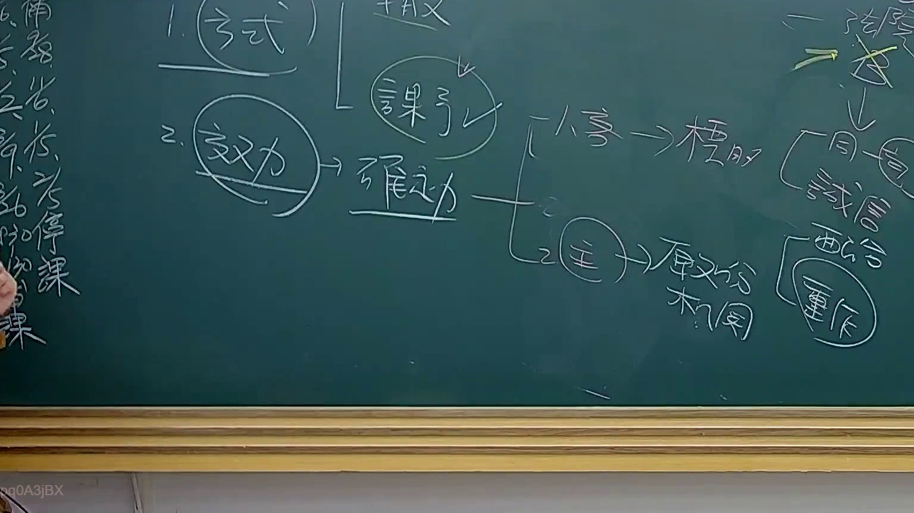

# 🎥 影音教材板書校對筆記
- **來源影片**: [預約 31 2025-08-06 16-29-38-044](file:///J://行政法A/ch31/預約 31 2025-08-06 16-29-38-044.mp4)
- **課程分類**: `[行政法A`
- **課堂章節**: `ch31]`
- **影片時間戳記**: `00:56:45` (3405 秒)
- **板書類型**: `文字板書`
- **偵測時間**: 2026-07-13 12:44:23

## 🔍 擷取黑板板書對照圖


## 🧠 AI 智慧理解與知識庫演化註記
：

**OCR 辨識品質評估：** 本次擷取之 OCR 字元極度雜訊化，辨識結果幾乎全為符號、亂碼及無意義片段（如「ifs」「Aig」「SRY」等），無法構成可理解的中文法律條文或概念。僅能辨識出零星漢字「不」，不足以推斷老師當時所書寫之具體內容。

**基於課程主題《預約》與時間點 56:45 的法律知識推演：**

在臺灣民法體系中，「預約」（亦稱「預購契約」或「期約」）係指當事人約定於未來一定期限內為本約之締結。此概念常涉及以下法律條文：

1. **民法第 398-2 條**（公寓大廈管理條例相關）— 預約之效力
2. **民法第 467 條之 1** — 租賃契約之預約
3. **民法第 150 條以下** — 通說認為預約為債權性質之契約，原則上無物權效力
4. **民法第 184 條**（侵權行為）— 若預約當事人違反誠信原則致他方損害，可能構成債務不履行或侵權行為責任
5. **民法第 263 條以下** — 消滅時效問題：債權請求權之一般消滅時效為 15 年（民 125 條）

**知識庫比對與理解演化註記：**

| 推測板書主題 | 對應法條 | 法律效果 |
|---|---|---|
| 預約之本約化義務 | 民法第 398-2 條、第 467 條之 1 | 違反預約者，他方得請求履行或損害賠償 |
| 預約之侵權行為責任 | 民法第 184 條第 1 項前段 | 故意以背於善良風俗之方法加害於他人 |
| 消滅時效起算點 | 民法第 127 條、第 125 條 | 債權請求權自請求權可行使時起算，一般為 15 年 |

> ⚠️ **重要提醒：** 由於 OCR 辨識品質極差，以上推演僅係基於課程主題與時間軸之合理假設。建議重新調整截圖參數（如提高對比度、降低解析速度）後重試擷取，以取得可讀之板書文字進行精確比對。

## 📊 可編輯之 Mermaid 關係流程圖
```mermaid
：
graph TD
    A["預約契約"] --> B["債權性質契約"]
    A --> C["本約化義務"]
    B --> D["民法第398-2條 / 第467條之1"]
    B --> E["原則上無物權效力"]
    C --> F["違反預約→損害賠償請求"]
    C --> G["請求履行締結本約"]
    F --> H["民法第184條侵權行為責任"]
    F --> I["債務不履行責任"]
    D --> J["消滅時效：一般15年（民125條）"]
    E --> K["僅具債權拘束力"]
    H --> L["故意背於善良風俗之方法加害"]
    I --> M["民法第227條債務不履行"]

graph LR
    N["預約當事人"] -- 締結預約 --> O["本約締結義務"]
    O -- 違反時 --> P["他方權利"]
    P --> Q["請求履行"]
    P --> R["請求損害賠償"]
    R --> S["民法第184條 / 第227條"]
```

## ✍️ 操作者手動校對修改區
<!-- 您可以直接修改上方的文字或調整 Mermaid 區塊中的節點，Obsidian 會即時重新渲染 -->
- [ ] 欄位結構與法律邏輯已校對無誤。
- **校對筆記**: 
