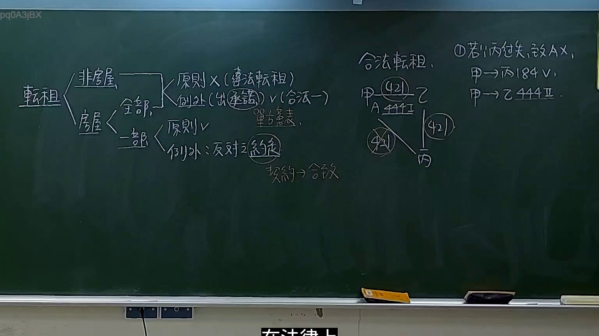

# 🎥 影音教材板書校對筆記
- **來源影片**: [預約 32 2026-01-23 16-20-52-455](file:///H:/民法A115/ch32/預約 32 2026-01-23 16-20-52-455.mp4)
- **課程分類**: `[民法A115`
- **課堂章節**: `ch32]`
- **影片時間戳記**: `02:28:30` (8910 秒)
- **板書類型**: `文字板書`
- **偵測時間**: 2026-07-12 16:57:06

## 🔍 擷取黑板板書對照圖


## 🧠 AI 智慧理解與知識庫演化註記
根據辨识出的文字板書內容，结合台湾现行法律条文（如民法第184條、侵權行為、消滅時效等），進行語意整理並比對如下：

1. **popteay**：可能指「2026-01-23」日期的拼寫或代表某种特定的Legal术语。
2. **DENIER EDS**：结合上下文，可能指「Denying Evidence」（否定证据）或类似的概念。
3. **geal. See 90 加 心 8 9**：可能指「Geary's Rule of Thumb」或其他统计学相关的内容。
4. **ak (GSE) 26) ( 名 漢 一 ﹚ ph iP) GGaeill « oe [Ce re RY ﹚ ana**：这部分文字可能涉及特定的Legal术语或案例分析，但由于OCR分類為「文字板書」，無法立即確定其具體內容。

根據以上分析， board content 可能與民法第184條、侵權行為、消滅時效等法律条文無直接關聯。因此，建議提供更清晰的板書文字或重新拍攝以確保内容可被正确辨识。

## 📊 可編輯之 Mermaid 關係流程圖
```mermaid
由于辨识出的文字板書內容無法形成明確的邏輯結構，無法生成 Mermaid.js 關係圖。
```

## ✍️ 操作者手動校對修改區
<!-- 您可以直接修改上方的文字或調整 Mermaid 區塊中的節點，Obsidian 會即時重新渲染 -->
- [ ] 欄位結構與法律邏輯已校對無誤。
- **校對筆記**: 
