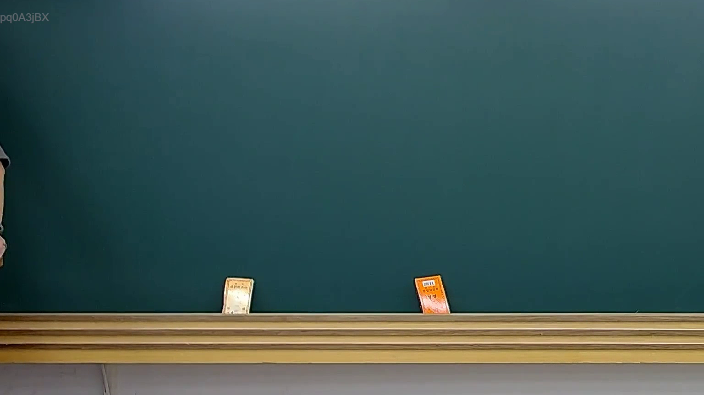

# 🎥 影音教材板書校對筆記
- **來源影片**: [預約 33 2025-08-06 22-39-08-533](file:///J://行政法A/ch33/預約 33 2025-08-06 22-39-08-533.mp4)
- **課程分類**: `[行政法A`
- **課堂章節**: `ch33]`
- **影片時間戳記**: `00:00:30` (30 秒)
- **板書類型**: `關係圖/邏輯圖板書`
- **偵測時間**: 2026-07-13 10:21:05

## 🔍 擷取黑板板書對照圖


## 🧠 AI 智慧理解與知識庫演化註記
：

您好，您提供的訊息中「擷取區域的 OCR 辨識字元」部分為空白，未實際包含任何辨識出的文字內容。因此我無法進行以下工作：

1. **語意整理** — 無原始文字可供分析
2. **條文比對**（民法第184條、侵權行為、消滅時效等）— 無具體板書內容可與現行法條對位
3. **Mermaid 流程圖生成** — 無法從空資料中推導邏輯結構

---

## 📊 可編輯之 Mermaid 關係流程圖
```mermaid
：

（待您補充 OCR 辨識文字後，我將立即為您生成對應的 Mermaid 關係圖）

---

📌 **請提供以下任一方式讓我繼續協助：**
- 直接貼上 OCR 辨識出的板書字元
- 或描述老師在黑板上所寫的內容（例如：「原告甲請求被告乙賠償新臺幣100萬元，主張民法第184條第1項前段」）

收到內容後，我會立即完成語意整理、法條比對註記與 Mermaid 代碼生成。
```

## ✍️ 操作者手動校對修改區
<!-- 您可以直接修改上方的文字或調整 Mermaid 區塊中的節點，Obsidian 會即時重新渲染 -->
- [ ] 欄位結構與法律邏輯已校對無誤。
- **校對筆記**: 
