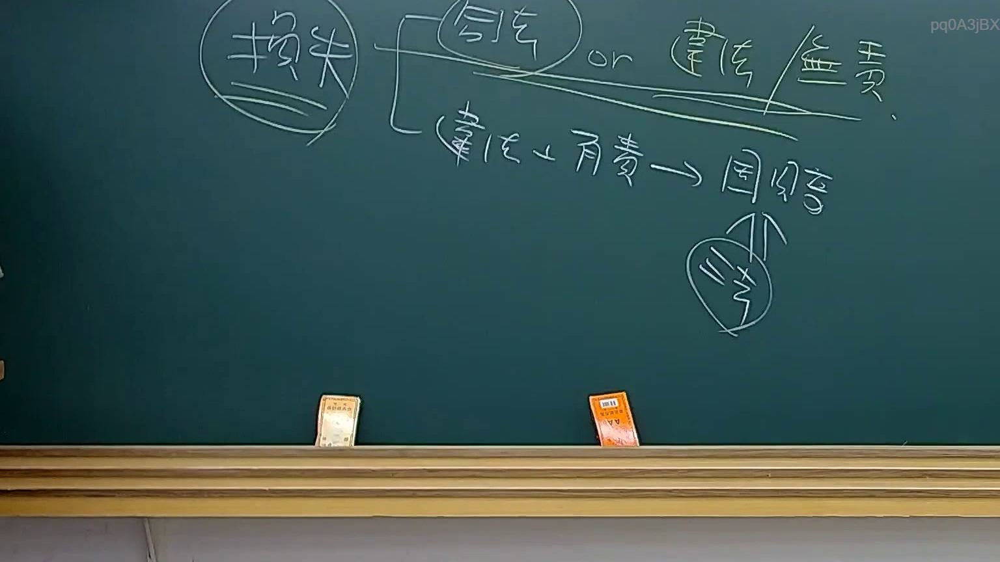
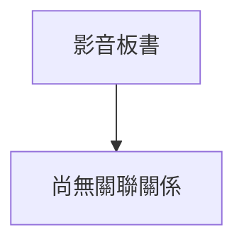

# 🎥 影音教材板書校對筆記
- **來源影片**: [預約 33 2025-08-06 22-39-08-533](file:///J://行政法A/ch33/預約 33 2025-08-06 22-39-08-533.mp4)
- **課程分類**: `[行政法A`
- **課堂章節**: `ch33]`
- **影片時間戳記**: `00:07:45` (465 秒)
- **板書類型**: `關係圖/邏輯圖板書`
- **偵測時間**: 2026-07-13 10:21:41

## 🔍 擷取黑板板書對照圖

## 🧠 AI 智慧理解與知識庫演化註記
：

您好，您提供的訊息中「擷取區域的 OCR 辨識字元如下：」之後**未附實際辨識出的文字內容**。我無法在沒有板書文字的基礎上進行語意整理、法律條文比對或生成 Mermaid 代碼。

請將 OCR 辨識結果貼上，例如：
- 「民法第184條...」
- 「侵權行為責任構成要件...」
- 或其他任何文字內容

一旦您提供板書文字，我將立即為您完成：
1. **語意整理**與**臺灣現行法律條文比對註記**（含民法、消滅時效等相關規定）
2. **Mermaid.js 關係圖/邏輯圖代碼**（依實際內容結構生成）

請補充 OCR 文字，我隨時待命。

## 📊 可編輯之 Mermaid 關係流程圖

## ✍️ 操作者手動校對修改區
<!-- 您可以直接修改上方的文字或調整 Mermaid 區塊中的節點，Obsidian 會即時重新渲染 -->
- [ ] 欄位結構與法律邏輯已校對無誤。
- **校對筆記**: 
