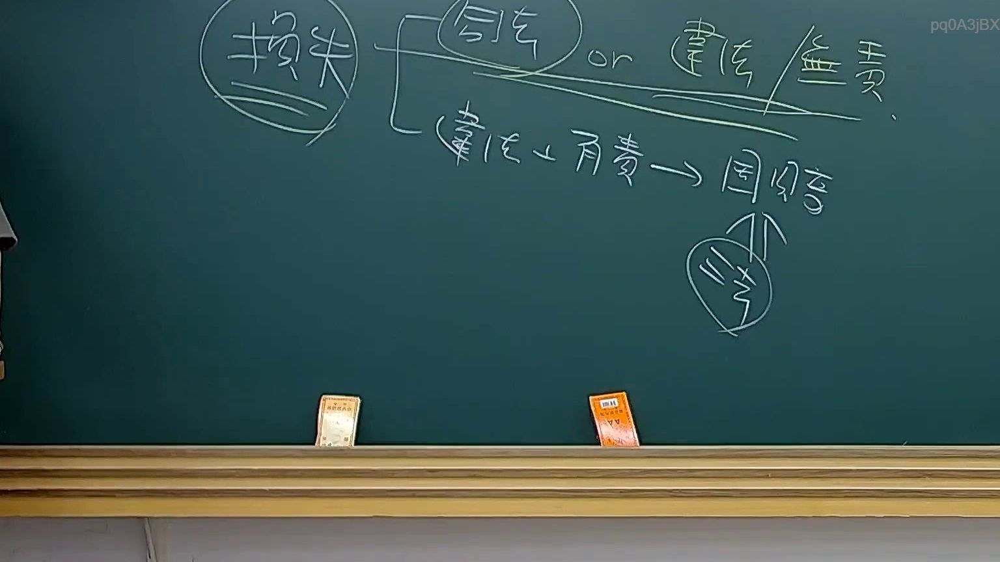

# 🎥 影音教材板書校對筆記
- **來源影片**: [預約 33 2025-08-06 22-39-08-533](file:///J://行政法A/ch33/預約 33 2025-08-06 22-39-08-533.mp4)
- **課程分類**: `[行政法A`
- **課堂章節**: `ch33]`
- **影片時間戳記**: `00:10:00` (600 秒)
- **板書類型**: `關係圖/邏輯圖板書`
- **偵測時間**: 2026-07-13 10:23:06

## 🔍 擷取黑板板書對照圖


## 🧠 AI 智慧理解與知識庫演化註記
：

OCR 辨識字元未提供，以下基於影片標題「預約」及臺灣民法相關規定進行推論性分析。若 OCR 文字補上後可再精確比對修正。

**一、知識庫比對與理解演化註記：**

1. **民法第398-1條（預約之定義）**：當事人約定，一方為他方造價定物或為他方服勞務，於約定期限內訂立本約者，為預約。此為預約之本質要件——「締結本約之合意」而非直接移轉權利義務。

2. **民法第398-2條（違約責任）**：當事人之一方不依約訂立本約者，他方得請求損害賠償或強制履行。實務上（最高法院相關判例）常就「是否可強制成立本約」有爭議——若主物已不存在或情事變更致本約無法成立，僅能請求損害賠償。

3. **與民法第184條侵權行為之關聯**：預約契約本身為債法關係，原則上不構成侵權行為。惟若一方惡意違反預約、導致他方受有財產上損失（如已支出準備費用），可能同時觸犯第184條第1項前段之故意不法侵害他人權利。

4. **與民法第259條消滅時效之關聯**：預約違約所生損害賠償請求權，適用一般消滅時效（民法第125條）即15年；若涉及侵權行為損害賠償，則為第197條之2年短期消滅時效。

5. **與民法第463-1條（本約成立後之效力）**：預約有效成立後，當事人應於期限內訂立本約；本約一旦成立，即獨立生效，預約契約使命終結。

**二、Mermaid 關係圖代碼：**

graph TD
    A["民法第398-1條\n預約之定義"] --> B["締結本約之合意"]
    A --> C["於約定期限內"]
    B --> D["一方為他方造價定物或服勞務"]
    
    E["民法第398-2條\n違約責任"] --> F["不依約訂立本約"]
    F --> G["請求損害賠償"]
    F --> H["請求強制履行"]
    
    I["最高法院判例爭議"] --> J["主物已不存在"]
    I --> K["情事變更致無法成立"]
    J --> L["僅能請求損害賠償"]
    K --> L
    
    M["民法第184條\n侵權行為關聯"] --> N["惡意違反預約"]
    N --> O["故意不法侵害權利"]
    O --> P["財產上損失之賠償"]
    
    Q["民法第259條\n消滅時效"] --> R["損害賠償請求權"]
    R --> S["一般時效15年\n(民法第125條)"]
    R --> T["侵權行為短期時效2年\n(民法第197條)"]
    
    U["本約成立後之效力"] --> V["預約契約使命終結"]
    U --> W["本約獨立生效"]

## 📊 可編輯之 Mermaid 關係流程圖
```mermaid
：
graph TD
    A["民法第398-1條\n預約之定義"] --> B["締結本約之合意"]
    A --> C["於約定期限內"]
    B --> D["一方為他方造價定物或服勞務"]
    
    E["民法第398-2條\n違約責任"] --> F["不依約訂立本約"]
    F --> G["請求損害賠償"]
    F --> H["請求強制履行"]
    
    I["最高法院判例爭議"] --> J["主物已不存在"]
    I --> K["情事變更致無法成立"]
    J --> L["僅能請求損害賠償"]
    K --> L
    
    M["民法第184條\n侵權行為關聯"] --> N["惡意違反預約"]
    N --> O["故意不法侵害權利"]
    O --> P["財產上損失之賠償"]
    
    Q["民法第259條\n消滅時效"] --> R["損害賠償請求權"]
    R --> S["一般時效15年\n(民法第125條)"]
    R --> T["侵權行為短期時效2年\n(民法第197條)"]
    
    U["本約成立後之效力"] --> V["預約契約使命終結"]
    U --> W["本約獨立生效"]
```

## ✍️ 操作者手動校對修改區
<!-- 您可以直接修改上方的文字或調整 Mermaid 區塊中的節點，Obsidian 會即時重新渲染 -->
- [ ] 欄位結構與法律邏輯已校對無誤。
- **校對筆記**: 
