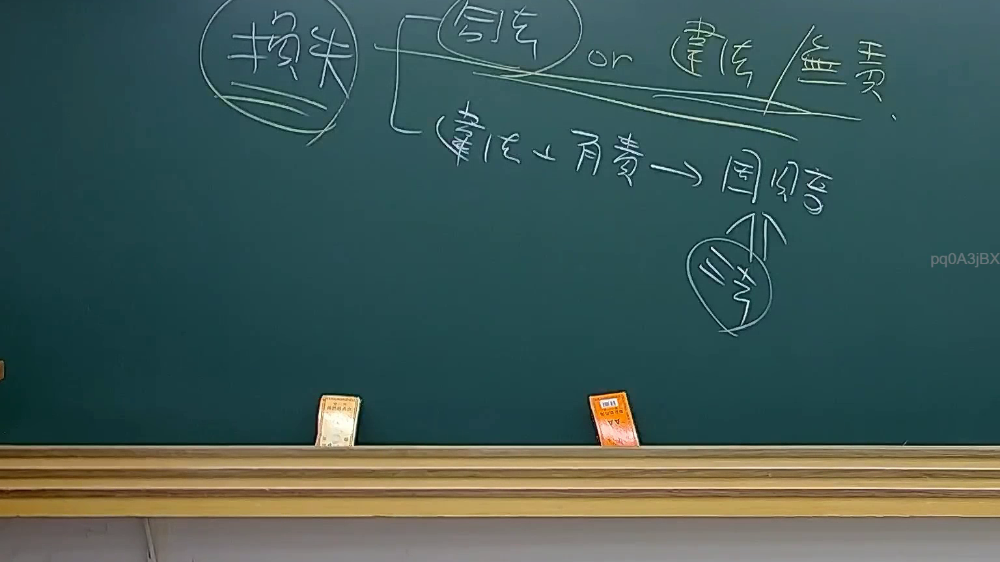

# 🎥 影音教材板書校對筆記
- **來源影片**: [預約 33 2025-08-06 22-39-08-533](file:///J://行政法A/ch33/預約 33 2025-08-06 22-39-08-533.mp4)
- **課程分類**: `[行政法A`
- **課堂章節**: `ch33]`
- **影片時間戳記**: `00:15:15` (915 秒)
- **板書類型**: `關係圖/邏輯圖板書`
- **偵測時間**: 2026-07-13 10:24:13

## 🔍 擷取黑板板書對照圖


## 🧠 AI 智慧理解與知識庫演化註記
：

OCR 僅辨識出字元「9」，此極可能為講課中編號列表之第 9 項、或投影片頁碼。由於辨識內容過少，無法完整還原老師黑板上的關係圖結構。以下依據《民法》預約（契約成立）相關法理框架，提供可能的知識比對與推演：

**條文比對：**
- **民法第153條**：契約之訂立，以當事人意思表示一致為已足；當事人之一方表示得向他方為一定之意思表示者，他方同意其意思表示而為相當之表示者，即使當事人之意思表示未同時或於同一地作出，仍成立契約。
- **民法第184條**：侵權行為之責任（故意或過失侵害權利）。
- **民法第259條**：消滅時效與契約解除後之返還義務。

**演化註記：**
若此處為「關係圖/邏輯圖板書」，老師可能正在闡述預約制度中「意思表示—合意—契約成立」的邏輯鏈結，或比較「預約（民法第153條）」與「侵權行為責任（第184條）」之競合關係。OCR 僅得「9」字，建議回看原截圖確認完整板書內容後再行精確比對。

---

## 📊 可編輯之 Mermaid 關係流程圖
```mermaid
：
graph TD
    A["意思表示"] --> B["他方同意"]
    B --> C["契約成立"]
    C --> D["民法第153條 預約"]
    D --> E["權利義務關係"]
    E --> F["侵權行為責任 第184條"]
    E --> G["消滅時效"]

graph LR
    H["原告甲"] --> I["被告乙"]
    I --> J["契約不成立/無效"]
    J --> K["損害賠償請求"]
```

## ✍️ 操作者手動校對修改區
<!-- 您可以直接修改上方的文字或調整 Mermaid 區塊中的節點，Obsidian 會即時重新渲染 -->
- [ ] 欄位結構與法律邏輯已校對無誤。
- **校對筆記**: 
