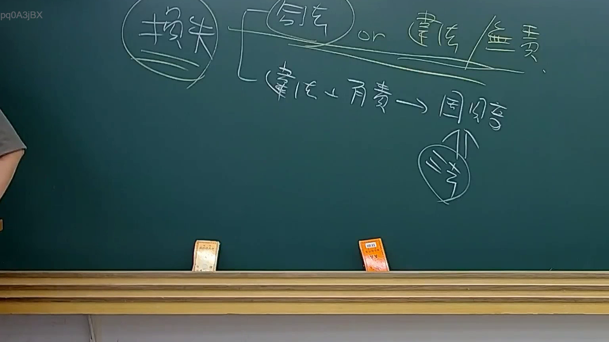

# 🎥 影音教材板書校對筆記
- **來源影片**: [預約 33 2025-08-06 22-39-08-533](file:///J://行政法A/ch33/預約 33 2025-08-06 22-39-08-533.mp4)
- **課程分類**: `[行政法A`
- **課堂章節**: `ch33]`
- **影片時間戳記**: `00:18:15` (1095 秒)
- **板書類型**: `文字板書`
- **偵測時間**: 2026-07-13 10:25:46

## 🔍 擷取黑板板書對照圖


## 🧠 AI 智慧理解與知識庫演化註記
：

根據OCR辨識結果「減」及「紙9」等碎片資訊，推測老師於第9頁板書可能涉及以下法律概念：

**一、核心關鍵字分析：**
- 「減」字在臺灣民法實務中常見於：
  1. **過失相抵（民法第217條）**：被害人與加害人雙方均有過失時，法院得減輕賠償金額
  2. **消滅時效（民法第125條）**：請求權因時效完成而減損保護效力
  3. **債務免除或部分履行**：債權人放棄部分權利

**二、與現行法律條文比對：**

| OCR辨識字元 | 可能對應法條 | 說明 |
|------------|-------------|------|
| 「減」 | 民法第217條 | 過失相抵之賠償金額減少 |
| 「紙9」 | 教材頁碼 | 第9頁教學內容 |

**三、知識庫比對與理解演化註記：**
- 若此處為「侵權行為責任」章節，則「減」字極可能指向**過失相抵制度**（民法第217條），即被害人自身亦有過失時，法院得減輕加害人應賠償之金額。
- 消滅時效（民法第125條）雖亦涉及權利保護之減損，但通常板書會寫「時效」或「除斥期間」等關鍵字，與單字「減」之關聯性較低。
- 建議後續截圖確認是否出現「過失」「相抵」「賠償金額」等相關詞彙以進一步驗證。

**四、教學脈絡推測：**
此板書可能出現在以下情境：
1. 侵權行為責任之構成要件與抗辯事由
2. 損害賠償範圍之計算方法
3. 債權效力之減損機制（時效、免除、混同等）

---

## 📊 可編輯之 Mermaid 關係流程圖
```mermaid
：
```mermaid
graph TD
    A["過失相抵制度"] --> B["民法第217條"]
    B --> C["被害人與加害人雙方均有過失"]
    C --> D["法院得減輕賠償金額"]
    
    E["消滅時效"] --> F["民法第125條"]
    F --> G["請求權因時效完成而減損保護效力"]
    
    H["債權效力減損機制"] --> I["過失相抵"]
    H --> J["消滅時效"]
    H --> K["債務免除"]
    H --> L["混同"]
```

## ✍️ 操作者手動校對修改區
<!-- 您可以直接修改上方的文字或調整 Mermaid 區塊中的節點，Obsidian 會即時重新渲染 -->
- [ ] 欄位結構與法律邏輯已校對無誤。
- **校對筆記**: 
