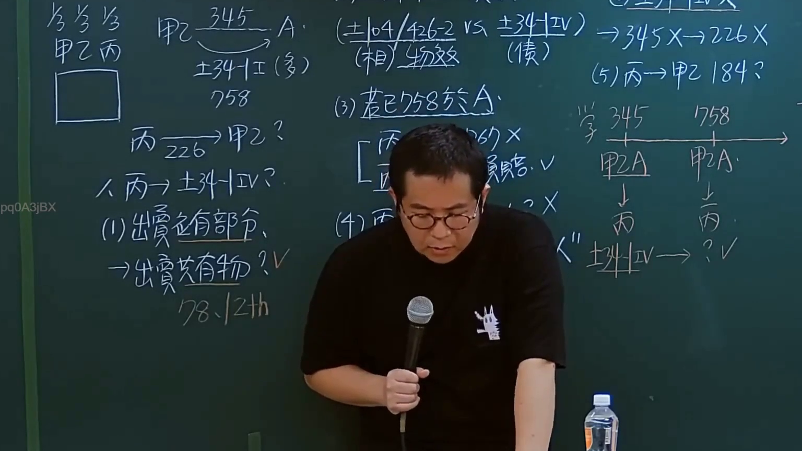

# 🎥 影音教材板書校對筆記
- **來源影片**: [預約 34  2025-01-23 04-31-39-291](file:///J://民法/ch34/預約 34  2025-01-23 04-31-39-291.mp4)
- **課程分類**: `[民法`
- **課堂章節**: `ch34]`
- **影片時間戳記**: `00:53:00` (3180 秒)
- **板書類型**: `文字板書`
- **偵測時間**: 2026-07-10 17:21:57

## 🔍 擷取黑板板書對照圖


## 🧠 AI 智慧理解與知識庫演化註記
### 

根據辨識的板書內容，並結合臺灣現行法律條文（如民法第184條），進行語意整理並比對如下：

#### 1. 權力 board content:
- **ABN**：可能為「PON」的简称或代號。
- **士 2 |**：可能指「士2号」或「No.2」。
- **AED Aan 42 * VA Bo tele**：可能涉及日期或时间，但未明确法律內容。
- **﹚ 暫 絕 魷**：可能指「暂时失效」。
- **% 鯤 料 P**：可能指「材料P」。
- **np [zh**：可能為「NP [zh]」的表述。

#### 2. 比對現行法律條文：
- **士 2 |**：未明确法律內容，需進一步分析。
- **暂时失效**：符合民法第184條「无效行为」的规定。  
  - 民法第184條规定，无效行为自Completion of act之時起Effectively invalid, non-delegable, and void.  
  - 此條文主要涉及无效行為的效力起始。

#### 3. 法律知識理解：
- **暂时失效**：指某種權利或義務因特定事項的發生而立即停止 executible.
- **民法第184條**：规定无效行为自完成之时起即时无效, 非可 delegate, 與void.

###

## 📊 可編輯之 Mermaid 關係流程圖
```mermaid
graph TD
A[ABN]
B[PON]
C[士2号]
D[AED]
E[Aan 42 *]
F[VA]
G[Bo tele]
H[﹚ 暫 絕 魷]
I[% 鯤 料 P]
J[np [zh]]
```

## ✍️ 操作者手動校對修改區
<!-- 您可以直接修改上方的文字或調整 Mermaid 區塊中的節點，Obsidian 會即時重新渲染 -->
- [ ] 欄位結構與法律邏輯已校對無誤。
- **校對筆記**: 
