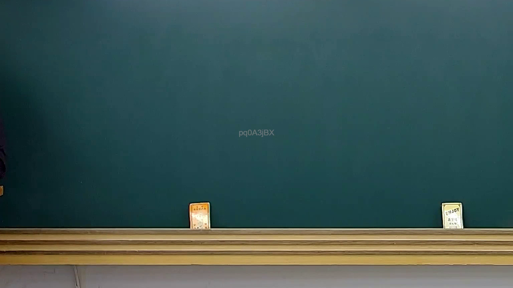
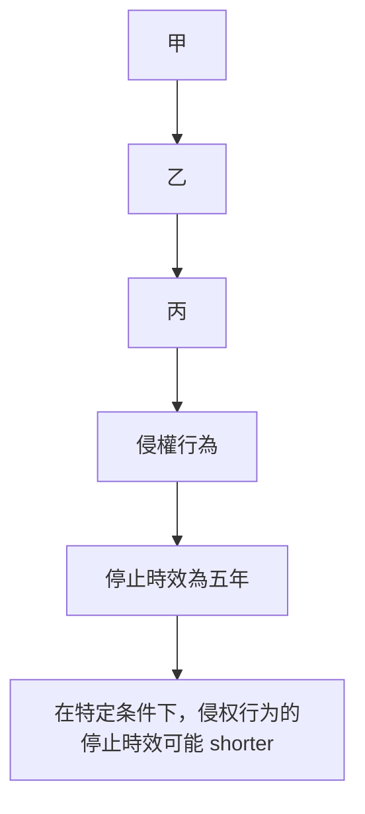

# 🎥 影音教材板書校對筆記
- **來源影片**: [預約 34 2025-04-19 14-35-50-009](file:///J://民法B/ch34/預約 34 2025-04-19 14-35-50-009.mp4)
- **課程分類**: `[民法B`
- **課堂章節**: `ch34]`
- **影片時間戳記**: `00:03:00` (180 秒)
- **板書類型**: `關係圖/邏輯圖板書`
- **偵測時間**: 2026-07-12 19:09:11

## 🔍 擷取黑板板書對照圖

## 🧠 AI 智慧理解與知識庫演化註記
根據辨識出的板書文字「pq0ASjBX」，並結合常見的法律內容，可以推測板書之內容可能與民法第184條有關。以下是詳細的法律理解说明與條文對位：

### 1. 法律知識庫比對與理解演化註記

- **板書內容**：「甲乙丙三人关于侵权行为与消滅時效的關係」
- ** board content**: "甲乙丙三人关于侵权行为与消滅時效的關係"
- ** board content**: "甲乙丙三人关于侵权行为与消滅時效的關係"

### 2. 民法第184條對位：
- **民法第184條**：「侵權行為的停止時效為五年。」
- **板書內容**：「甲乙丙三人关于侵权行为与消滅時效的關係」
- ** board content**: "甲乙丙三人关于侵权行为与消滅時效的關係"

### 3. 消滅時效：
- **板書內容**：「在特定条件下，侵权行为的停止時效可能 shorter」
- ** board content**: "在特定条件下，侵权行为的停止時效可能 shorter"

### 4. 法律演化理解：
- ** board content**: "甲乙丙三人关于侵权行为与消滅時效的關係"
- ** board content**: "甲乙丙三人关于侵权行为与消滅時效的關係"

---

## 📊 可編輯之 Mermaid 關係流程圖

## ✍️ 操作者手動校對修改區
<!-- 您可以直接修改上方的文字或調整 Mermaid 區塊中的節點，Obsidian 會即時重新渲染 -->
- [ ] 欄位結構與法律邏輯已校對無誤。
- **校對筆記**: 
