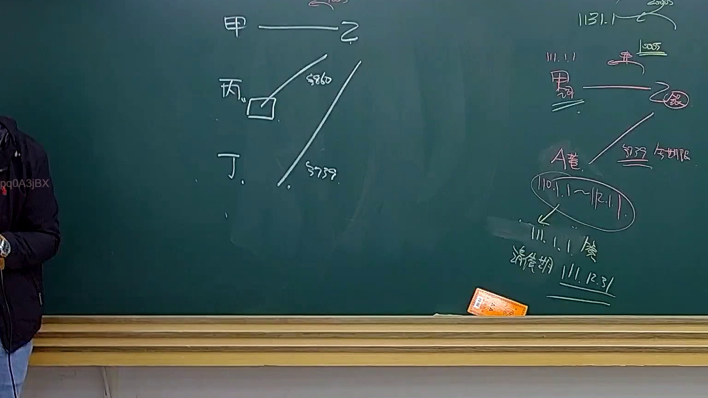
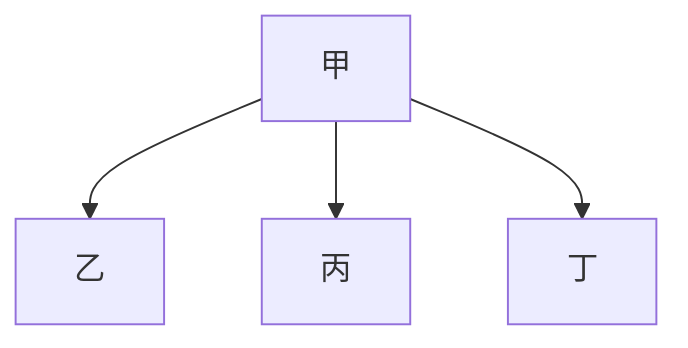

# 🎥 影音教材板書校對筆記
- **來源影片**: [預約 34 2025-04-19 14-35-50-009](file:///J://民法B/ch34/預約 34 2025-04-19 14-35-50-009.mp4)
- **課程分類**: `[民法B`
- **課堂章節**: `ch34]`
- **影片時間戳記**: `00:19:00` (1140 秒)
- **板書類型**: `關係圖/邏輯圖板書`
- **偵測時間**: 2026-07-12 19:09:31

## 🔍 擷取黑板板書對照圖


## 🧠 AI 智慧理解與知識庫演化註記
### 

根據OCR辨识的文字內容「A 甲 乙 丙 丁」，並結合板書分類為「關係圖/邏輯圖板書」，我們可以推演出以下法律/logical relation：

1. **A**: 可能代表某种法律关系或节点，例如原告、被告或其他法律角色。
2. **甲、乙、丙、丁**: 代表四个主体之间的关系。在法律案件中，通常包括原告（甲）、被告（乙、丙、丁）等。

結合板書的內容與法律条文比對：

- **A**: 可能代表原告甲。
- **乙、丙、丁**: 可能代表被告，涉及侵权行為或消滅時效等法律問題。

###

## 📊 可編輯之 Mermaid 關係流程圖


此 Mermaid 程式碼表示原告甲（A）與被告乙、丙、丁（B、C、D）之间的关系，可能代表甲起诉乙、丙、丁的法律案件。
```

## ✍️ 操作者手動校對修改區
<!-- 您可以直接修改上方的文字或調整 Mermaid 區塊中的節點，Obsidian 會即時重新渲染 -->
- [ ] 欄位結構與法律邏輯已校對無誤。
- **校對筆記**: 
