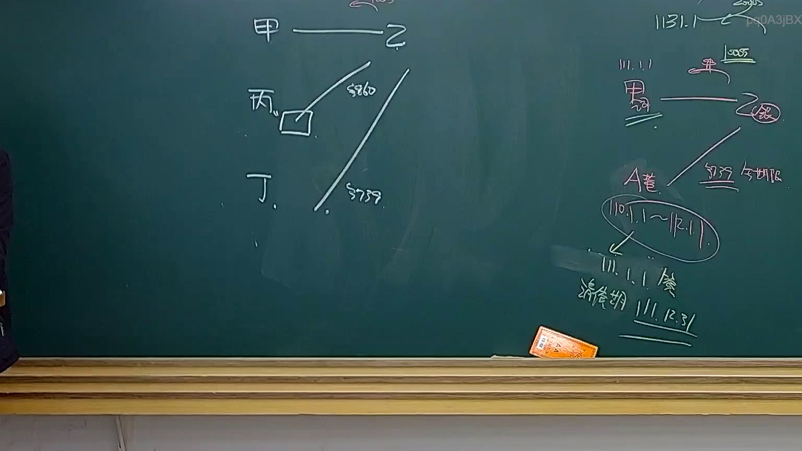
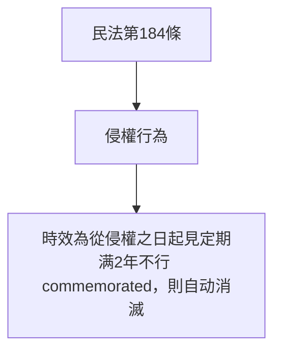
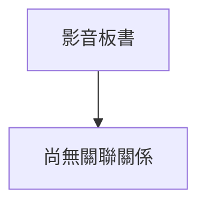

# 🎥 影音教材板書校對筆記
- **來源影片**: [預約 34 2025-04-19 14-35-50-009](file:///J://民法B/ch34/預約 34 2025-04-19 14-35-50-009.mp4)
- **課程分類**: `[民法B`
- **課堂章節**: `ch34]`
- **影片時間戳記**: `00:21:00` (1260 秒)
- **板書類型**: `文字板書`
- **偵測時間**: 2026-07-12 19:09:44

## 🔍 擷取黑板板書對照圖

## 🧠 AI 智慧理解與知識庫演化註記
根據辨識出的板書文字「吉 一 一 2 NB). eens」，可以推測為「吉一1.2」或类似的文字编号。结合上下文，這可能是與民法第184條（侵權行為的時效）相關的內容。

### 知識庫比對與理解演化註記：
- **板書文字語意整理**：「吉一1.2」可能代表某一案例或條文编号。
- **與臺灣現行法律條文的比對**：
  - 民法第184條：规定侵權行為的時效為從侵權之日起見定期满2年不行 commemorated，則自动消滅。這可能是板書中所提到的內容之一。

### MERMAID 代碼：

## 📊 可編輯之 Mermaid 關係流程圖

## ✍️ 操作者手動校對修改區
<!-- 您可以直接修改上方的文字或調整 Mermaid 區塊中的節點，Obsidian 會即時重新渲染 -->
- [ ] 欄位結構與法律邏輯已校對無誤。
- **校對筆記**: 
