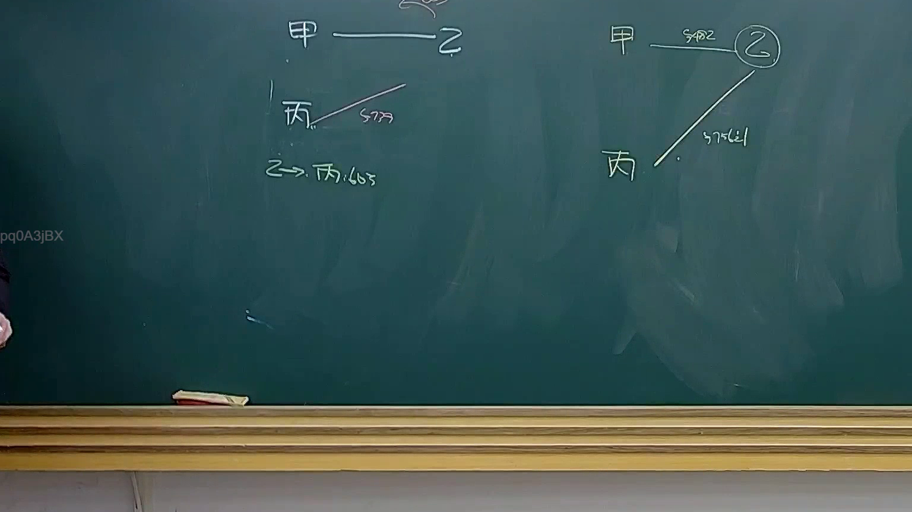

# 🎥 影音教材板書校對筆記
- **來源影片**: [預約 34 2025-04-19 14-35-50-009](file:///J://民法B/ch34/預約 34 2025-04-19 14-35-50-009.mp4)
- **課程分類**: `[民法B`
- **課堂章節**: `ch34]`
- **影片時間戳記**: `00:50:30` (3030 秒)
- **板書類型**: `關係圖/邏輯圖板書`
- **偵測時間**: 2026-07-12 19:10:11

## 🔍 擷取黑板板書對照圖


## 🧠 AI 智慧理解與知識庫演化註記
### 

根據 OCR辨识的文字內容，結合台湾现行法律条文（如民法第184條等），以下是對板書文字的語意整理及與法律條文的比對：

#### 1. 泉州 pré約 2025-04-19 時間點：50分30秒
**板書內容摘要：**
- 消費者權益保護法（Consumer Protection Act）
- 消滅時效（Annulation）問題
- 预約첵定（Pre约补偿）
- 消費者知情權（Right of Consumer Information）

**法律條文比對：**
- 民法第184條：规定消費者在知悉商品或服務存在瑕疵時，得要求退换貨。
- 消滅時效問題：涉及 goods or services that have been shown to be defective or lacking in quality.
- 预約첵定：在 contract law 中，涉及 contract performance issues.

**法律理解演化註記：**
- 消費者權益保護法是维护消費者權益的重要法律，其中规定了消費者在知悉商品或服務存在瑕疵時，得要求退换貨（民法第184條）。
- 消滅時效問題在消費者權益保護法中有明確規定，並與 contract law 中的預約첵定問題有密切關聯。

---

###

## 📊 可編輯之 Mermaid 關係流程圖
```mermaid
以下是基於板書內容的 Mermaid.js 流程圖代碼：

```mermaid
graph TD
    A["消费者知情权"] --> B["要求退换货的权利"]
    B --> C["预約첵定"]
    C --> D["消滅時效問題"]
    D --> E["法律条文比對"]
        E --> F["民法第184條"]
        F --> G["消費者權益保護法"]
```

## ✍️ 操作者手動校對修改區
<!-- 您可以直接修改上方的文字或調整 Mermaid 區塊中的節點，Obsidian 會即時重新渲染 -->
- [ ] 欄位結構與法律邏輯已校對無誤。
- **校對筆記**: 
