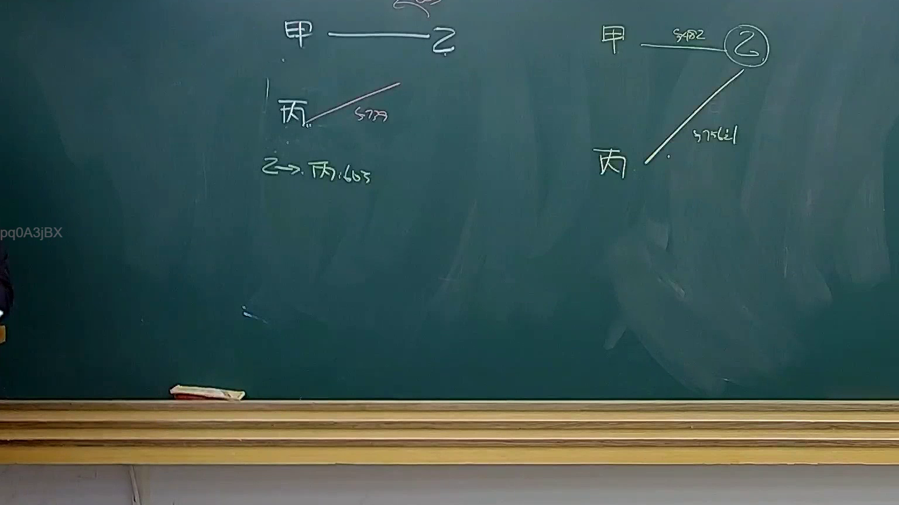
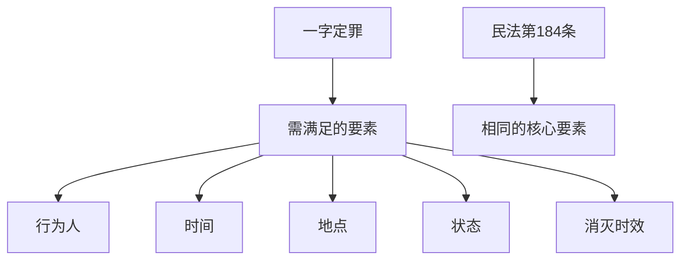

# 🎥 影音教材板書校對筆記
- **來源影片**: [預約 34 2025-04-19 14-35-50-009](file:///J://民法B/ch34/預約 34 2025-04-19 14-35-50-009.mp4)
- **課程分類**: `[民法B`
- **課堂章節**: `ch34]`
- **影片時間戳記**: `00:51:15` (3075 秒)
- **板書類型**: `文字板書`
- **偵測時間**: 2026-07-12 19:10:24

## 🔍 擷取黑板板書對照圖

## 🧠 AI 智慧理解與知識庫演化註記
### 

**「一字定罪」（STA i）的法律含義及條文對位：**

1. **一字定罪（STA i）的定義：**
   - 指在特定条件下，只要存在某一行为即可定罪，无需举证其他事实的行为。
   - 主要涉及以下要素：
     1. 行为人
     2. 时间
     3. 地点
     4. 状态（如健康状况）
     5. 消滅時效（消灭时效）

2. **與民法第184條的對比：**
   - 民法第184條規定「一字定罪」的條件：
     1. 必须有明确的行为人
     2. 时间和地点符合法定条件
     3. 状态符合法定条件（如健康）
     4. 消滅時效符合法定條件

** legal implications and case law:**
   - 一字定罪通常用于特定的犯罪行为，如故意杀人、过失致人死亡等。
   - 必须严格遵守法定条件，否则可能无法适用一字定罪。

###

## 📊 可編輯之 Mermaid 關係流程圖

## ✍️ 操作者手動校對修改區
<!-- 您可以直接修改上方的文字或調整 Mermaid 區塊中的節點，Obsidian 會即時重新渲染 -->
- [ ] 欄位結構與法律邏輯已校對無誤。
- **校對筆記**: 
