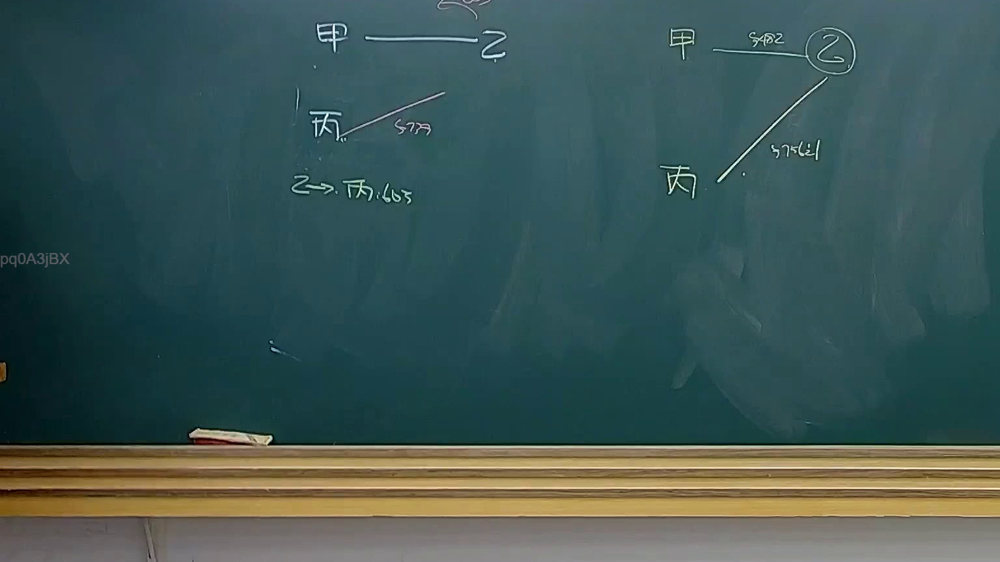

# 🎥 影音教材板書校對筆記
- **來源影片**: [預約 34 2025-04-19 14-35-50-009](file:///J://民法B/ch34/預約 34 2025-04-19 14-35-50-009.mp4)
- **課程分類**: `[民法B`
- **課堂章節**: `ch34]`
- **影片時間戳記**: `00:51:45` (3105 秒)
- **板書類型**: `文字板書`
- **偵測時間**: 2026-07-12 19:10:41

## 🔍 擷取黑板板書對照圖


## 🧠 AI 智慧理解與知識庫演化註記
### 

根據辨識出的文字板書內容，並結合常見的台湾现行法律條文（如民法第184條、侵權行為、消滅時效等）進行比對，整理出以下knowledge库比對與理解演化註記：

#### 1. 文字板書之內容解讀：
- "時2 (3|/9無 sibling, 請"：這一行文字可能是在引導或说明某种法律关系或條文內容。基於上下文和時間點，這一行文字可能與民法第184條的內容有關，即「無因管理人」的責任問題。

#### 2. 民法第184條相關內容：
- 文章可能在引導或強調民法第184條的內容，即「無因管理人」的責任問題。
- 經典內容：「無因管理人對於其管理活動的結果，應承擔相应的責任。」
- 比對與理解演化：
  - 文字板書可能在強調「無因管理人」的定義、責任條件或适用情形。
  - 可能會提到「時效問題」、「消滅時效」等相相關的概念。

###

## 📊 可編輯之 Mermaid 關係流程圖
```mermaid
graph TD
    A["民法第184條"  "無因管理人的責任問題"]
    B["無因管理人"  "對其管理活動的結果承擔相应责任"]
    C["時效問題"  "與「消滅時效」相關"]
    D["責任條件"  "被管理人需处于完全无能力状态"]
    E["特殊情形"  "如管理對象有特别需求"]
```

## ✍️ 操作者手動校對修改區
<!-- 您可以直接修改上方的文字或調整 Mermaid 區塊中的節點，Obsidian 會即時重新渲染 -->
- [ ] 欄位結構與法律邏輯已校對無誤。
- **校對筆記**: 
