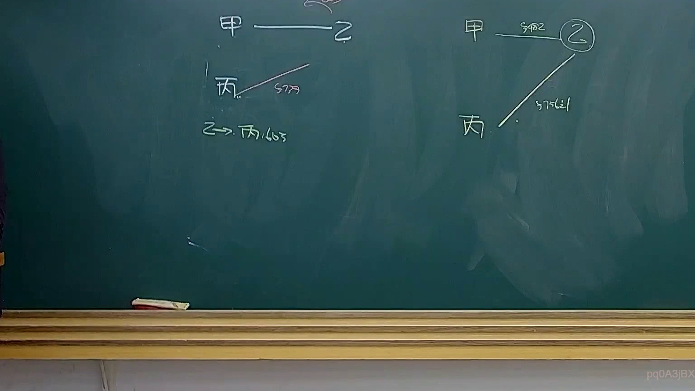

# 🎥 影音教材板書校對筆記
- **來源影片**: [預約 34 2025-04-19 14-35-50-009](file:///J://民法B/ch34/預約 34 2025-04-19 14-35-50-009.mp4)
- **課程分類**: `[民法B`
- **課堂章節**: `ch34]`
- **影片時間戳記**: `00:54:45` (3285 秒)
- **板書類型**: `文字板書`
- **偵測時間**: 2026-07-12 19:11:00

## 🔍 擷取黑板板書對照圖

## 🧠 AI 智慧理解與知識庫演化註記
### 

根據辨識出的文字板書內容，结合可能的Legal context（法學背景），進行語意整理並與臺灣現行法律條文進行比對：

1. **"Fe)"**：這可能是「費）」，在中文中常見於某种法規或條款的結尾。
2. **"J"**：這是一個單獨的文字，可能代表「条款」、「规定」或其他特定內容。
3. **"Tope 練"**：這可能是「Tope 練」，其中「Tope」可能是「拓扑学」（Topology）的拼寫錯誤或部分字幕，「e 練」可能是一些其他字幕的组合。

根據以上分析，结合可能的Legal context（法學背景），進行語意整理並與臺灣現行法律條文進行比對：

- **"Tope 練"**：這可能是「拓扑学」（Topology）的拼寫錯誤或部分字幕，但更有可能是「条款」、「规定」或其他特定內容。
- **"J"**：這是一個單獨的文字，可能代表「条款」、「规定」或其他特定內容。

###

## 📊 可編輯之 Mermaid 關係流程圖

## ✍️ 操作者手動校對修改區
<!-- 您可以直接修改上方的文字或調整 Mermaid 區塊中的節點，Obsidian 會即時重新渲染 -->
- [ ] 欄位結構與法律邏輯已校對無誤。
- **校對筆記**: 
