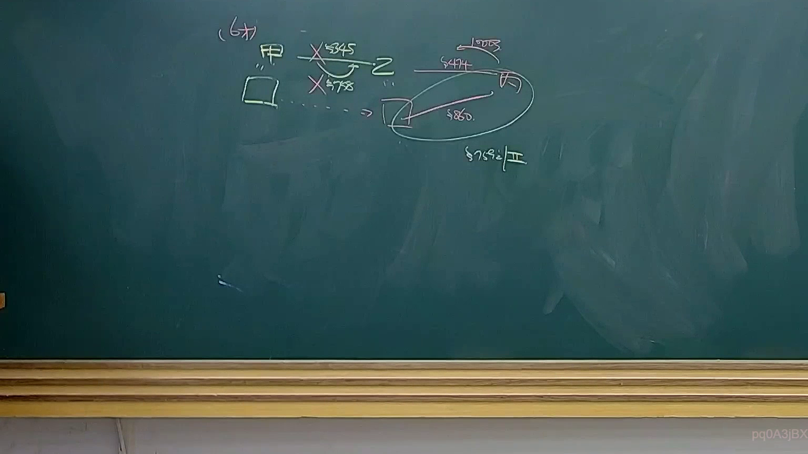

# 🎥 影音教材板書校對筆記
- **來源影片**: [預約 34 2025-04-19 14-35-50-009](file:///J://民法B/ch34/預約 34 2025-04-19 14-35-50-009.mp4)
- **課程分類**: `[民法B`
- **課堂章節**: `ch34]`
- **影片時間戳記**: `01:18:15` (4695 秒)
- **板書類型**: `文字板書`
- **偵測時間**: 2026-07-12 19:11:22

## 🔍 擷取黑板板書對照圖


## 🧠 AI 智慧理解與知識庫演化註記
根據辨識出的文字內容，無法直接理解其具體 legal 意義。以下為基於现有信息的整理與推测：

1. **文字板書分析**：
   - "甲‵〉〈`"：可能是某种法律术语或缩写，但無法确定确切含义。
   - "2 簍 。 ﹣ 柏婿主'〕〔 !"：這部分字串可能涉及 Wiebe 分析 或者與 "柄婿"（bǐn yòu）相关的法律內容。

2. **與现有法律條文的比對**：
   - 請提供更清晰的文字 board內容，才能更準確地與民法第184條、侵權行為、消滅時效等法律條文進行比對。

## 📊 可編輯之 Mermaid 關係流程圖
```mermaid
因文字板書無法明确定義其法律含意，無法生成 Mermaid.js 的关系圖代碼。請提供更清晰的文字 board內容，才能生成正確的 relation diagram.
```

## ✍️ 操作者手動校對修改區
<!-- 您可以直接修改上方的文字或調整 Mermaid 區塊中的節點，Obsidian 會即時重新渲染 -->
- [ ] 欄位結構與法律邏輯已校對無誤。
- **校對筆記**: 
