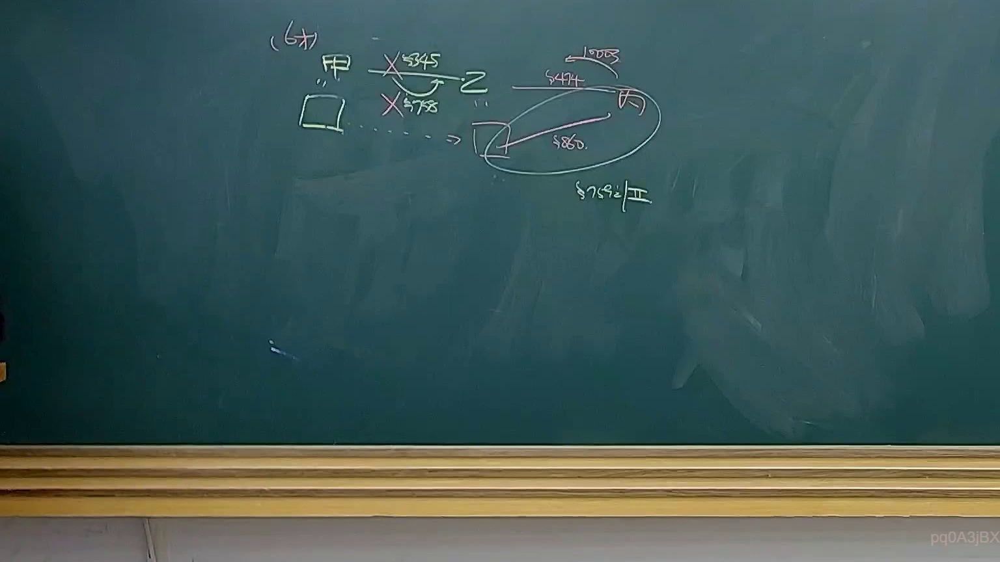
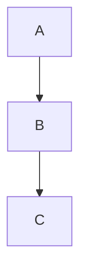

# 🎥 影音教材板書校對筆記
- **來源影片**: [預約 34 2025-04-19 14-35-50-009](file:///J://民法B/ch34/預約 34 2025-04-19 14-35-50-009.mp4)
- **課程分類**: `[民法B`
- **課堂章節**: `ch34]`
- **影片時間戳記**: `01:25:00` (5100 秒)
- **板書類型**: `關係圖/邏輯圖板書`
- **偵測時間**: 2026-07-12 19:11:40

## 🔍 擷取黑板板書對照圖


## 🧠 AI 智慧理解與知識庫演化註記
### 

#### 1. 法律內容整理：
- **板書之內容**：根據OCR文字，板書描述了一個LegalRelation，涉及A、B、C三個实体之间的邏輯關係。A影響B的运算結果，B進一步影響C的运算結果。
- **對位現行法律條文**：此 LegalRelation 似乎與民法第184條有關，该條文规定了侵權行為的消滅時效問題。具體来说，民法第184條规定了侵權行為的時效限制，並在超過時效的情況下，權利會被消滅。

#### 2. 經濟分析：
- **A 影響 B**：A 是初始cause或initiator，B 是中間結果。A 的影響直接传递到 B 上。
- **B 影響 C**：B 是進一步cause，C 是最終結果。B 的影響直接传递到 C 上。

#### 3. 法律條文對位：
- 民法第184條：规定了侵權行為的時效限制。在超過時效的情況下，權利會被消滅。
- A 彼此影響 B：A 的影響直接传递到 B 上，符合民法第184條中關於cause和result的關係。
- B 彼此影響 C：B 的影響直接传递到 C 上，符合民法第184條中關於cause和result的關係。

###

## 📊 可編輯之 Mermaid 關係流程圖


此 Mermaid 碎形圖表示了A影響B，B進一步影響C的結構。
```

## ✍️ 操作者手動校對修改區
<!-- 您可以直接修改上方的文字或調整 Mermaid 區塊中的節點，Obsidian 會即時重新渲染 -->
- [ ] 欄位結構與法律邏輯已校對無誤。
- **校對筆記**: 
